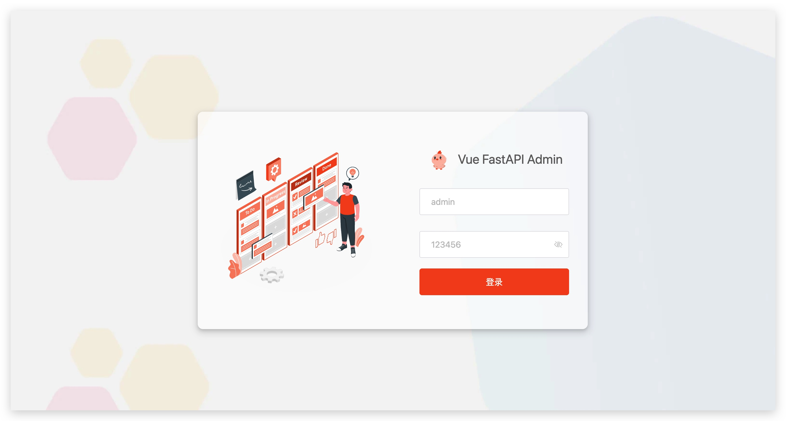
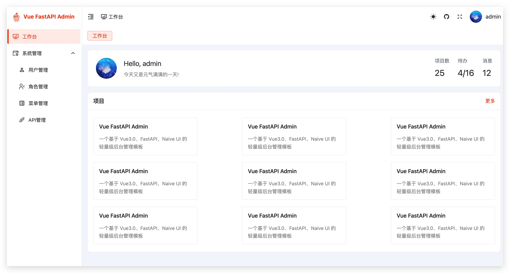
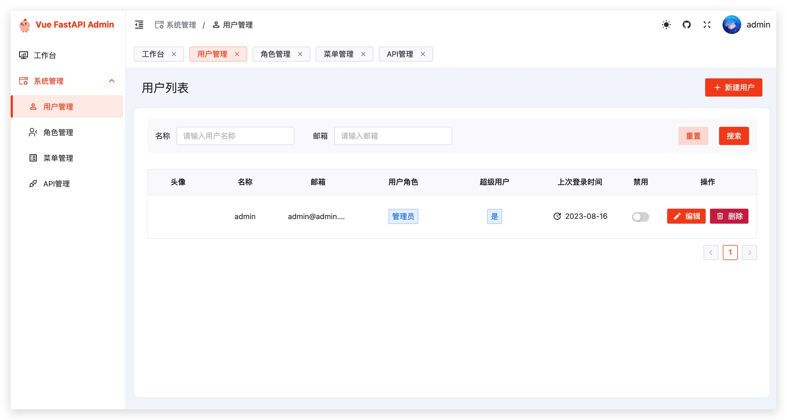
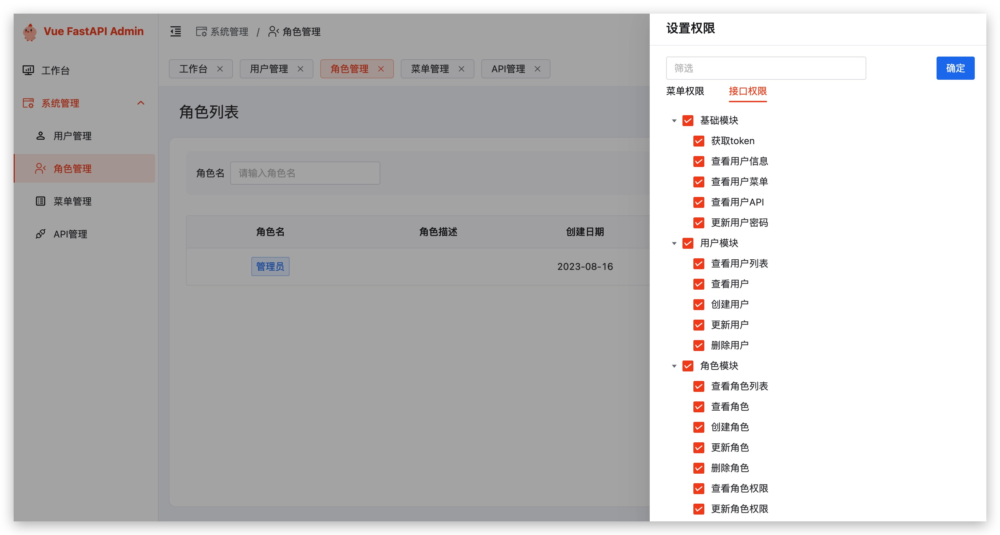
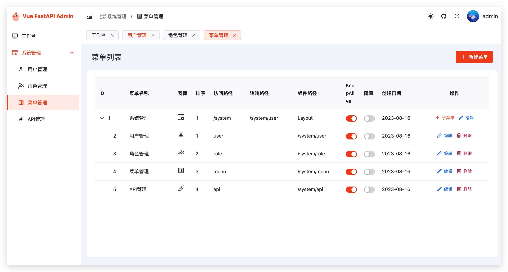
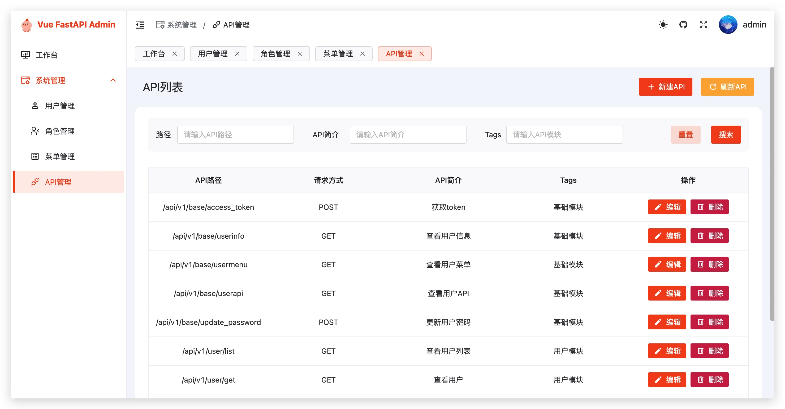

# vue-fastapi-admin

基于 FastAPI、Vue 3、Naive UI 的前后端分离后台管理系统。项目提供用户、角色、菜单、部门、API 权限和审计日志等基础管理能力，适合作为内部管理系统的基础工程。

当前仓库地址：

```text
http://172.16.4.42:82/icp/fastapi-vue-admin.git
```

## 功能概览

- 用户管理：支持用户增删改查、重置密码、启用或停用用户。
- 角色管理：支持角色维护，并可按角色分配菜单和接口权限。
- 菜单管理：支持后台动态菜单和前端动态路由。
- 部门管理：支持组织部门维护。
- API 管理：支持扫描和维护后端接口权限。
- 审计日志：记录接口访问行为，便于追踪操作。
- 认证鉴权：使用 JWT 登录认证，并支持按钮级和接口级权限控制。

## 技术栈

后端：

- Python 3.11
- FastAPI
- Tortoise ORM
- Aerich
- SQLite 默认数据库
- Uvicorn

前端：

- Vue 3
- Vite
- Naive UI
- Pinia
- Vue Router
- Axios
- UnoCSS
- pnpm

## 环境要求

- Python 3.11 或以上版本
- Node.js 18.8.0 或以上版本
- pnpm
- Git

Docker 部署需要 Docker 17.05 或以上版本。

## 本地启动

### 启动后端

推荐使用 `uv` 管理后端依赖。

```powershell
pip install uv
uv venv
.\.venv\Scripts\activate
uv sync
python run.py
```

后端默认监听：

```text
http://localhost:9999
```

接口文档地址：

```text
http://localhost:9999/docs
```

如果不用 `uv`，也可以使用 `pip` 安装依赖：

```powershell
python -m venv .venv
.\.venv\Scripts\activate
pip install -r requirements.txt -i https://pypi.tuna.tsinghua.edu.cn/simple
python run.py
```

### 启动前端

```powershell
cd web
npm i -g pnpm
pnpm install
pnpm dev
```

前端默认端口来自前端环境配置，当前为：

```text
http://localhost:3100
```

开发环境中，前端会把 `/api/v1` 请求代理到后端服务。

## 默认账号

首次启动后端时，系统会自动初始化数据库、菜单、接口权限、角色和默认管理员账号。

```text
用户名：admin
密码：123456
```

请在正式环境中及时修改默认密码。

## Docker 部署

构建镜像：

```powershell
docker build --no-cache . -t vue-fastapi-admin
```

启动容器：

```powershell
docker run -d --restart=always --name vue-fastapi-admin -p 9999:80 vue-fastapi-admin
```

访问地址：

```text
http://localhost:9999
```

Docker 镜像内会先构建前端静态资源，再通过 Nginx 提供前端页面，并把 `/api/` 请求转发给后端服务。

## 常用命令

后端常用命令：

```powershell
python run.py
ruff check ./app
black ./ --check
isort ./ --profile black --check
```

前端常用命令：

```powershell
cd web
pnpm dev
pnpm build
pnpm lint
```

## 项目结构

```text
├── app                  后端应用代码
│   ├── api              API 路由
│   ├── controllers      业务控制器
│   ├── core             应用核心能力，例如中间件、异常处理、通用 CRUD
│   ├── log              日志配置
│   ├── models           数据模型
│   ├── schemas          请求和响应数据结构
│   ├── settings         后端配置
│   └── utils            工具函数
├── deploy               部署配置和示例图片
├── web                  前端应用代码
│   ├── build            Vite 构建配置
│   ├── public           前端公共资源
│   ├── settings         前端项目配置
│   └── src              前端源码
├── Dockerfile           Docker 镜像构建文件
├── Makefile             后端开发辅助命令
├── pyproject.toml       后端项目和依赖配置
├── requirements.txt     后端 pip 依赖清单
└── uv.lock              后端 uv 锁定文件
```

## 提交规则

以下内容不应提交到 Git 仓库：

- Python 虚拟环境，例如 `.venv/`
- 前端依赖目录，例如 `node_modules/`
- 本地 SQLite 数据库文件，例如 `db.sqlite3`
- Python 缓存目录，例如 `__pycache__/`
- 本地构建产物，例如前端 `dist/`
- 本地迁移生成目录，例如 `migrations/`

当前 `.gitignore` 已包含这些规则。

## 配置注意事项

- 后端默认使用 SQLite，数据库文件会在本地运行时生成。
- 后端服务默认端口为 `9999`。
- 前端开发服务默认端口为 `3100`。
- 当前代码中存在默认 `SECRET_KEY`，正式环境建议改为通过环境变量注入。
- 默认管理员密码仅适合初始化测试，正式环境必须修改。

## 页面预览

登录页：



工作台：



用户管理：



角色管理：



菜单管理：



API 管理：


