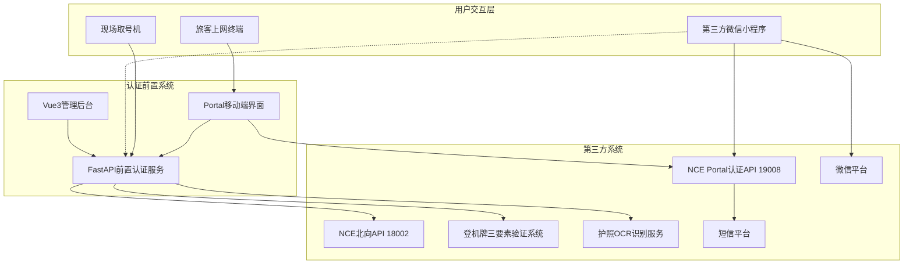
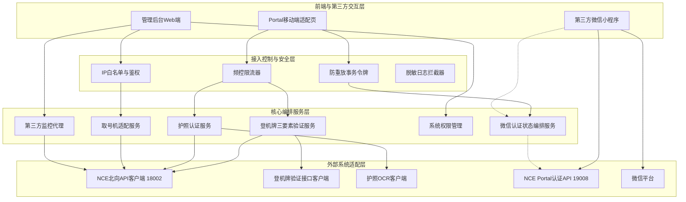
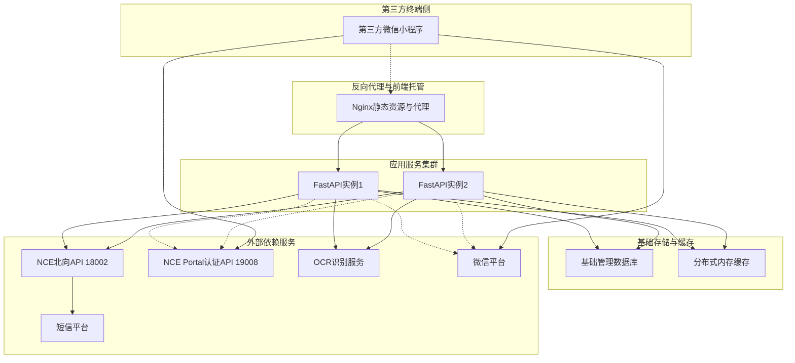
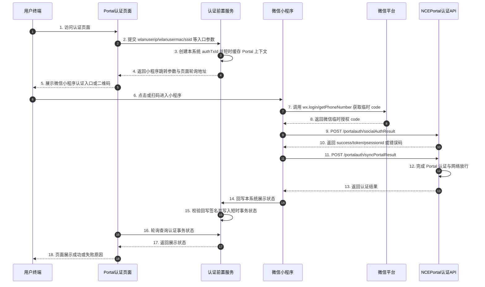
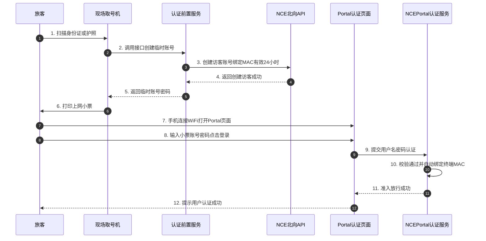
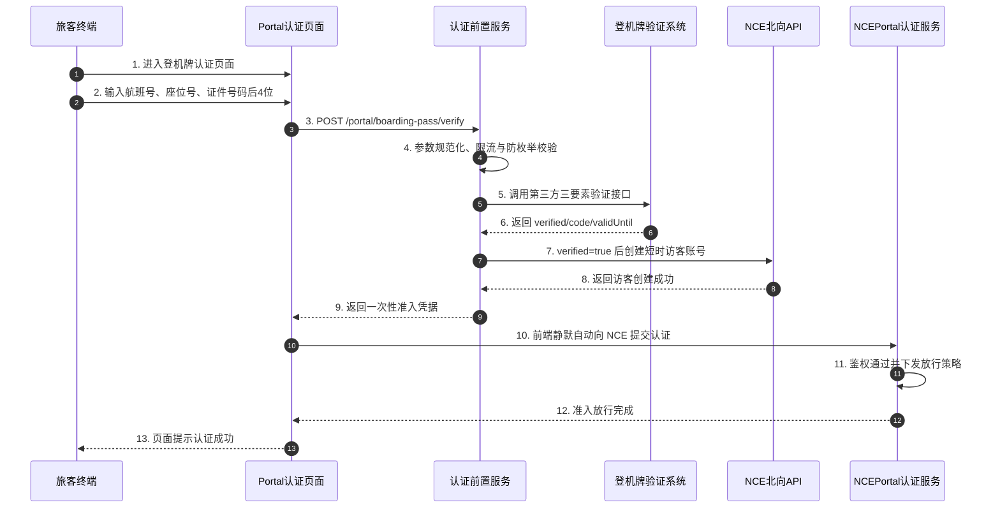
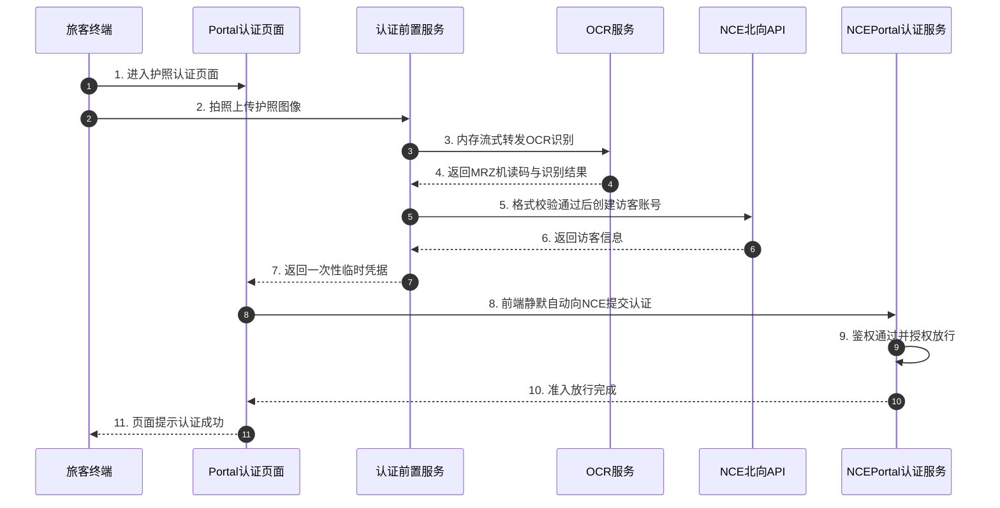
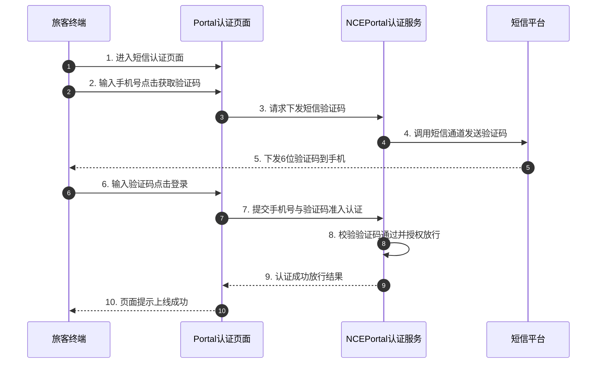
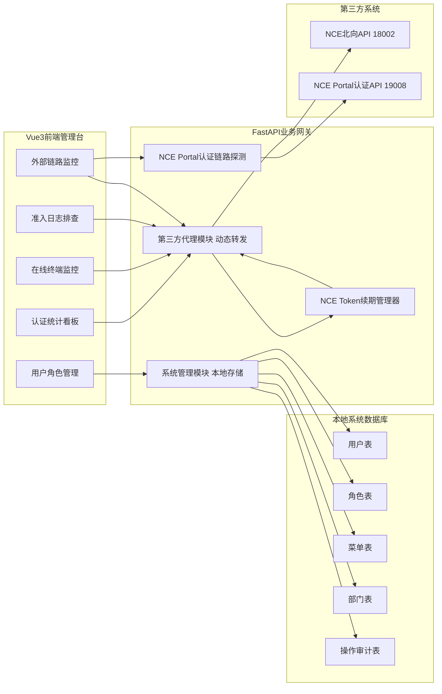

# 深圳机场WiFi多方式认证系统详细设计说明书

| 文档版本 | 发布日期 | 编制人 | 审核人 | 状态 | 适用工程范围 |
| :--- | :--- | :--- | :--- | :--- | :--- |
| **V1.0** | 2026-09-04 | 系统架构组 | 专家评审组 | 待评审基线 | `vue-fastapi-admin` / 前置认证服务 / Portal 移动端 |

---

## 一、 项目概述与业务背景

### 1.1 建设背景与业务目标
深圳宝安国际机场作为国内超大型航空枢纽，日均保障进出港旅客十数万人次。旅客在航站楼内通过手机、笔记本等智能终端接入公共免费 WiFi 是机场关键的服务体验保障。
本项目目标在于搭建一套**纯软件形态的统一认证前置服务与运维管理平台**，为航站楼旅客提供便捷、合规、高可用、高并发的多渠道网络准入体验，覆盖五类认证方式：
1. **微信小程序认证**：旅客从本系统 Portal 跳转或拉起第三方微信小程序，小程序调用 NCE Portal 认证接口完成放行后，向本系统回写展示状态；
2. **现场取号机认证**：旅客在机场自助设备扫描身份证/护照换取临时账号，绑定设备 MAC，享受 24 小时在线权益；
3. **登机牌认证**：旅客输入航班号、座位号、购票/值机证件号码后 4 位，系统后端调用第三方登机牌三要素验证接口，验证通过后创建 NCE 临时访客并完成准入；
4. **护照认证**：外籍及港澳台旅客通过拍照上传护照，经 OCR 格式校验通过后一键准入；
5. **短信认证**：基于华为 iMaster NCE-Campus 原生短信认证流程，高效下发验证码完成准入。

### 1.2 核心系统定位与架构原则（零业务数据存储）
> [!IMPORTANT]
> **本系统坚决贯彻“零业务数据持久化 / 纯无状态前置网关”的核心架构原则：**
> 1. **不存储旅客业务数据**：本地数据库（MySQL/SQLite）严禁建表持久化旅客任何业务隐私，包括但不限于旅客姓名、完整证件号、登机牌号、航班号、座位号、手机号、护照图像、MAC 上网追踪记录等。
> 2. **轻量无状态网关**：前置服务（FastAPI）定位为“业务流程编排器与外部接口协议适配网关”。所有终端准入生命周期管理全部交由核心控制器 **华为 iMaster NCE-Campus** 承担。
> 3. **管理后台数据全代理**：运维管理后台仅保留管理员身份、角色分配与系统菜单配置。管理后台中的“认证趋势图表”、“在线用户数统计”、“准入日志排查”等页面，**全部由前置服务端实时反向代理调用 iMaster NCE-Campus 等第三方北向接口获取并聚合渲染**，本地不维护统计明细底表。

### 1.3 软件系统边界与外部系统交互
系统整体处于终端交互与第三方核心系统之间，扮演协议桥接与安全网关角色：



### 1.4 设计依据与约束条件
本详细设计基于以下资料和现场联调结论编制：

- 现有 `vue-fastapi-admin` 后端、前端工程结构；
- 《深圳机场需求设计认证服务器》需求资料；
- 《深圳机场WIFI认证开发计划.xlsx》实施计划；
- 本地 Postman 集合中的 NCE 北向接口实测结果；
- 华为 iMaster NCE-Campus Portal 微信小程序认证接口文档；
- 现网联调结论：`18002` 为 NCE 北向 API，`19008` 为 NCE Portal 认证 API。

关键约束如下：

- 本系统只做认证前置、协议适配、状态编排和运维展示，不替代 NCE 的准入控制能力；
- 本系统不持久化旅客业务隐私数据；
- 微信小程序放行必须使用真实 Portal 会话参数、真实微信授权 `code` 和有效 `pushPageId`；
- 第三方接口地址、账号、密钥、Token 和站点参数必须通过环境配置或受控密钥方式注入，不写入代码。

### 1.5 术语与缩略语
| 术语 | 说明 |
| :--- | :--- |
| NCE | 华为 iMaster NCE-Campus，本项目中的网络准入控制核心系统 |
| NCE 北向 API | NCE 提供给第三方系统调用的管理类接口，当前联调端口为 `18002` |
| NCE Portal 认证 API | NCE Portal 提供的准入认证接口，当前微信小程序联调端口为 `19008` |
| Portal 页面 | 旅客连接机场 WiFi 后打开的认证入口页面 |
| 状态回写 | 第三方微信小程序完成 NCE Portal 放行后，把展示状态同步给本系统 |
| authTxId | 本系统生成的短时认证事务 ID，仅用于串联页面状态，不作为 NCE 放行凭据 |
| PII | 个人身份信息，包括姓名、手机号、证件号、终端 MAC 等敏感信息 |

---

## 二、 系统总体架构设计

### 2.1 整体分层逻辑架构
系统采用现代化前后端分离的无状态微服务模式构建：



说明：微信小程序认证的业务放行动作由第三方微信小程序直接调用 NCE Portal 认证 API 完成；本系统的微信认证状态编排服务只负责生成跳转上下文、接收状态回写和辅助链路探测。

### 2.2 软件部署架构与运行环境

#### 2.2.1 软件部署拓扑
系统采用轻量级容器化与微服务集群部署模式，由反向代理、应用服务容器、本地基础数据库与缓存组成：



说明：FastAPI 实例到 NCE Portal 认证 API 的虚线表示健康探测或联调辅助，不表示后端代替小程序发起准入放行。微信小程序完整放行链路仍以小程序到 NCE Portal 认证 API 为准。

#### 2.2.2 软件技术栈与运行环境要求
* **运行操作系统**：Linux (EulerOS / CentOS / Debian / Ubuntu) 或 Windows Server
* **容器引擎**：Docker 24.0+，支持 Docker Compose 编排
* **后端运行环境**：Python 3.11+，基于 ASGI 异步生态（FastAPI + Uvicorn + Pydantic v2）
* **前端运行环境**：Node.js 18+（构建阶段），生产环境由 Nginx 1.24+ 托管静态文件
* **系统基础数据库**：SQLite（单机轻量）或 MySQL 8.0+（高可用主备），**仅存储管理员/角色/菜单权限等基础管理数据**
* **缓存组件**：Redis 7.0+（用于分布式滑动窗口限流、NCE Token 集中共享与防重放 Nonce 缓存）

#### 2.2.3 软件高可用容灾与负载均衡
1. **多 Worker 异步并发**：FastAPI 后端由 Gunicorn/Uvicorn 启动多 Worker 进程，基于异步非阻塞 I/O 处理高并发外部接口代理请求。
2. **Nginx 负载均衡**：Nginx 配置 `upstream` 负载分发池，支持心跳检测与请求权重轮询，保障单实例故障时流量秒级切换。
3. **环境配置解耦**：所有外部系统接口地址、Token 密钥、超时时间等均通过环境变量（`.env`）统一配置，支持测试环境与生产环境一键热切换。

### 2.3 零业务数据存储与无状态网关实现机制
为保证数据合规（满足个人信息保护法要求，杜绝旅客轨迹合规风险），系统设计了“三不原则”与“一次性内存令牌机制”：
1. **不存数据库表**：ORM（Tortoise-ORM）模型仅保留系统管理员、角色表、菜单路由表与系统操作审计表（仅记录管理员在后台的操作，不记录旅客信息）。
2. **内存瞬时流转，阅后即焚**：
   - 旅客完成登机牌三要素验证或护照 OCR 识别后，服务端生成一次性短暂有效的临时密码（随机 8 位高强字符串）；微信小程序认证不走本系统临时密码链路，由第三方小程序直接调用 NCE Portal 认证 API 放行；
   - 前置服务调用 NCE 写入访客账号后，将账号与临时密码包装在一次性认证事务凭据（`txToken`）中返回给前端；
   - 前端拿到凭据后立即向 Portal 认证服务器发起准入，随后在前端内存中立即擦除；
   - 护照图像通过内存二进制流上传至 OCR，识别完成后立即释放内存，磁盘**不写临时文件、不做缓存落盘**。
3. **统计数据全代理穿透**：
   - 当管理员打开后台“认证统计”或“在线终端监控”时，前端请求 FastAPI 网关；
   - FastAPI 网关利用已缓存的 NCE Admin Token，实时调用 NCE 北向的 `/controller/campus/v1/accessservice/onlineusers` 或统计 API；
   - FastAPI 进行字段清洗与 ECharts 数据结构转换后返回前端展示，本地完全不存明细库。

---

## 三、 五类 WiFi 认证方式详细设计

### 3.1 微信小程序认证（第三方小程序授权 + NCE Portal 放行）
#### 3.1.1 业务交互时序图
根据华为 iMaster NCE-Campus 小程序认证接口文档和现网联调结果，微信小程序认证的准入主链路必须由小程序调用 NCE Portal 南向认证接口完成。本系统负责 Portal 入口参数解析、跳转参数组装、状态展示和联调辅助，不替代 NCE 的准入放行能力。



#### 3.1.2 关键技术实现要点
1. **URL 协议唤起**：Portal 页面提取当前 URL 重定向参数中的 `wlanuserip`、`wlanusermac`、`ssid`，由前置服务生成本系统 `authTxId` 后，拼装成微信小程序打开链接或二维码参数：
   ```javascript
   const wxScheme = `weixin://dl/business/?t=XXXXX&authTxId=${authTxId}&ip=${userIp}&mac=${userMac}&ssid=${ssid}`;
   window.location.href = wxScheme;
   ```
2. **双模兼容体验**：针对非微信内置环境或不支持 URL Scheme 的机型，页面动态提供微信小程序二维码供扫码上网。
3. **NCE Portal接口为准入主链路**：小程序必须按 NCE 文档调用 `POST /portalauth/socialAuthResult` 和 `POST /portalauth/syncPortalResult`。`socialAuthResult` 成功返回的 `token` 与 `psessionid` 是第二步查询认证结果的必要凭据。
4. **真实业务参数不能伪造**：`state` 必须来自 NCE Portal/扫码认证流程生成的真实唯一标识；`code` 必须来自微信小程序 `wx.login()` 或 `getPhoneNumber()` 返回的临时授权码；`pushPageId` 必须来自 NCE Portal 定制页面。测试时手工填写 `test-state`、`test-code` 只能验证接口可达，不能完成业务放行。
5. **状态回写接收**：本系统提供微信认证状态回写接口，接收第三方小程序返回的认证结果、事务编号和终端标识。后端必须校验签名、时间戳和随机数，防止伪造回写与重放请求。该状态回写只负责本系统页面状态或调用摘要，不作为 NCE 放行依据。
6. **页面成功态展示**：认证成功后，本系统页面展示“登录成功”。页面成功态必须以 NCE `syncPortalResult` 成功为依据；第三方小程序只能把该成功结果回写给本系统，不能只以本系统 `authTxId` 存在或普通请求到达作为成功条件。
7. **状态兜底查询**：为处理小程序状态回写延迟、用户提前返回页面、弱网等情况，Portal 页面保留状态查询轮询能力。页面每 2 秒查询一次，超过 60 秒未成功则提示用户重试或切换其他认证方式。
8. **短时状态存储**：微信状态回写只允许写入 Redis 等短时缓存，TTL 固定为 5 分钟，仅保存 `authTxId`、认证结果、脱敏终端标识和过期时间，不落地旅客业务数据。

---

### 3.2 现场取号机认证（访客创建 + MAC 绑定 + 24 小时生命周期）
#### 3.2.1 业务交互时序图
现场取号机认证服务面向机场线下自助终端，支持身份证/护照刷证，生成绑定设备 MAC 的 24 小时临时访客账号：



#### 3.2.2 24 小时生命周期管控与 MAC 绑定策略
1. **生命周期设计**：
   - 取号机创建访客时，前置服务将 `beginTime` 设为当前时间戳，`endTime` 精确设置为 `当前时间 + 24 小时`（毫秒级）。
   - 在 NCE-Campus 中配置访客模板 `GuestRole_24H`，启用“到期自动注销并销毁账号”策略，无需本地维护定时清理任务。
2. **MAC 地址首次绑定（首次登录绑定）**：
   - 取号机打印小票时旅客通常尚未将手机接入取号机，因此取号机无法直接获知手机 MAC。
   - 解决方案：在 NCE-Campus 访客配置中开启 **“首次认证自动绑定终端 MAC（Max MAC Binding Count = 1）”**。旅客在手机端首次使用小票密码登录成功后，NCE 自动将该账号与首台登录设备的 MAC 强绑定，防止该账号被多台设备冒用。
3. **接口安全加固**：
   - 取号机与前置服务器之间配置 IP 白名单与 API 签名鉴权（HMAC-SHA256）防重放攻击。

---

### 3.3 登机牌认证（三要素验证 + NCE 访客创建 + Portal 准入）
#### 3.3.1 业务交互时序图
根据《深圳机场WiFi登机牌认证接口需求说明》，登机牌认证最终采用“航班号 + 座位号 + 购票/值机证件号码后 4 位”三要素验证方案。浏览器不得直接调用第三方登机牌验证系统，必须由认证前置服务通过专线或受控网络同步调用第三方接口；第三方确认三项信息属于同一旅客、同一航段、同一张当前有效登机牌后，系统再进入 NCE 访客创建与准入流程：



#### 3.3.2 三要素验证与字段处理规则
1. **旅客输入字段**：
   - `flightDate`：出港当地日期，格式 `YYYY-MM-DD`，默认取当天并允许页面选择；
   - `flightNo`：航班号，去空格并转大写，例如 `CA1234`；
   - `seatNo`：座位号，去空格并转大写，例如 `16A`；
   - `documentLast4`：购票或值机证件号码后 4 位，仅允许 4 位字母或数字。
2. **适用范围**：
   - 仅适用于深圳机场出港、国内航空公司、已办理值机并已生成有效登机牌的旅客；
   - 进港、中转但非深圳出港、国际/地区航班、未值机或登机牌已取消/作废的旅客，引导使用短信、微信或护照认证方式。
3. **第三方验证规则**：
   - 第三方必须按机场、日期、出港方向、航班、座位、值机状态和证件后四位进行同一性校验；
   - 航班号、座位号、证件后四位必须属于同一旅客、同一航段、同一张当前有效登机牌，不允许分别命中后拼接为通过；
   - 联程、代码共享、航班变更、换座和重复打印场景，以当前有效承运航段和最新有效座位为准。
4. **验证通过判定**：
   - 第三方接口 `success=true` 仅表示接口处理成功，不等同于认证通过；
   - 只有 `success=true` 且 `verified=true` 且业务结果码为 `0000` 时，认证前置服务才允许创建 NCE 临时访客账号；
   - `verified=false`、接口超时、鉴权失败、第三方数据源不可用时，均不得创建 NCE 访客。
5. **隐私与防枚举**：
   - 系统只接收证件号码后 4 位，不接收、不传输、不记录完整证件号；
   - 日志不得记录 `documentLast4` 明文，可记录带密钥摘要用于排障关联；
   - 旅客端不展示“航班不存在”“座位不存在”“尾号不匹配”等差异化提示，统一提示“登机信息验证未通过，请检查后重试或选择其他认证方式”；
   - 单 IP / MAC / 航班座位组合在 5 分钟内连续失败 5 次触发滑动窗口冷却，防止枚举旅客信息。

---

### 3.4 护照认证（OCR 识别 + 证件基础校验 + NCE 访客创建 + Portal 准入）
#### 3.4.1 业务交互时序图
针对外籍及无国内手机号的国际旅客，支持护照拍照后进行 OCR 解析验证准入：



#### 3.4.2 图像与隐私安全设计（零落盘）
1. **内存流转发**：FastAPI 接收 `UploadFile` 使用 `SpooledTemporaryFile`，在内存中完成大小限制检查（最大 4MB），直接将字节流推送给 OCR 接口，**严禁将图片写入磁盘保存**。
2. **校验边界说明**：此接口仅对护照机读码（MRZ, Machine Readable Zone）进行格式与校验码算法检查（Check Digit 算法校验），确认证件格式有效，不代表公安/边检人证核验或护照防伪验真。

---

### 3.5 短信认证（iMaster NCE-Campus 原生流程接入）
#### 3.5.1 业务交互时序图
短信认证作为旅客使用率最高、稳定性要求极苛刻的通道，系统采用 **NCE-Campus 原生短信流接入模式**。由 Portal 页面直接驱动 NCE 原生短信服务与准入闭环，本前置服务不截留、不中转短信数据：



#### 3.5.2 前端定制与 NCE 兼容规范
1. **DOM ID 与事件规范保留**：定制 Portal 前端模板时，严格保留 NCE 认证引擎所需的表单标签规范（如 `username`、`password`、`getSmscodeBtn`、`loginBtn`），确保 NCE 原生 JS 逻辑能够精准捕获事件与参数。
2. **体验优化**：增加国内主流手机号段正则校验、获取验证码 60 秒倒计时防重复点击、国际区号支持等用户友好交互。

---

## 四、 管理后台改造与第三方数据代理设计

### 4.1 管理后台定位与数据架构
管理后台直接复用并扩展现有的 `vue-fastapi-admin` 框架，其核心逻辑架构如下：



### 4.2 认证统计看板设计（第三方代理汇聚模式）
#### 4.2.1 统计数据流转方案
后台管理员打开“认证统计看板”时，FastAPI 服务端作为无状态网关，并发代理调用 iMaster NCE-Campus 的北向 API 获取数据：
1. **实时在线终端指标**：调用在线用户查询接口获取当前在线活跃数；
2. **今日准入趋势与成功率**：调用 `/controller/campus/v1/accountservice/user/radiuslog`，以今日 `00:00:00` 至当前时间为入参，分别获取 `authenResultCode=0`（成功）与 `authenResultCode=1`（失败）的记录总量，动态计算认证综合成功率；
3. **Top 5 失败原因分析**：通过过滤日志中的 `failReasonCode`（如 101 密码错误、105 锁定、106 过期、111 MAC不匹配、116 超时、642 验证码错误），进行内存归并排序，输出柱状图；
4. **认证方式分布统计**：基于日志中的 `userTypeCode`（0 普通、1 短信注册、5 微信、20 普通访客），聚合统计微信、短信、登机牌/护照/取号机各认证通道的分布饼图。

#### 4.2.2 看板前端组件划分
- **指标卡片区**：
  - 今日累计认证人次（基于 Radius 认证日志成功数计算）；
  - 当前全网在线终端数；
  - 今日认证平均耗时（秒级）；
  - 今日认证综合成功率（%）。
- **核心图表区**：
  - `TrendChart.vue`：24 小时各认证方式请求趋势折线图；
  - `MethodPieChart.vue`：5 种认证方式占比饼图（根据 `userTypeCode` 统计）；
  - `FailureBarChart.vue`：Top 失败原因统计柱状图（根据 `failReasonCode` 分析）。

### 4.3 日志监控与审计查询设计（脱敏与第三方代理）
#### 4.3.1 准入日志代理检索机制
管理后台的“准入日志监控”视图彻底落地“零本地业务数据存储”原则，直接通过代理调用 NCE 的 `POST /controller/campus/v1/accountservice/user/radiuslog` 接口实现实时分页检索：
- **分页游标流转**：
  - 首次查询：入参 `pageIndex=1`, `startRowKey=""`, `pageSize=101`；
  - 翻页查询：采用 NCE 返回的 `endRowKey` 作为下一次请求的 `startRowKey`，实现高效的百毫秒级游标分页；若返回记录数不足 101 条，前端提示已全部加载完毕。
- **复合过滤条件**：
  - 支持按时间范围（跨度允许 1~7 天）、`terminalMac`（终端 MAC）、`terminalIp`（终端 IP）、`userName`、`userTypeCode`（用户类型）、`authenResultCode`（成功/失败）联动过滤。
- **数据脱敏处理**：网关在将 NCE 返回的日志数据转交前端前，统一执行脱敏过滤器：
  - 手机号脱敏：针对短信认证账号（`userTypeCode=1`），显示为 `138****1234`；
  - 终端硬件与证件：证件后 4 位保留，其余掩码；
  - 彻底剔除敏感密码与身份哈希字段。

### 4.4 外部系统健康度与链路监控
后台提供“服务健康态监控”视图，每 60 秒对关键依赖进行被动与主动心跳探测：
- **NCE 北向 API 状态**：通过轻量 Token 查询探测延时（正常 < 200ms）；
- **登机牌三要素验证接口状态**：通过健康探针或脱敏测试数据探测连通性与业务响应；
- **护照 OCR 识别服务状态**：Mock 识别健康探针；
- **展示形式**：以仪表盘与告警色块（绿色：健康 / 黄色：波动 / 红色：离线）直观展示。

### 4.5 运行配置摘要与运维变更规范
管理后台只提供运行配置摘要展示，不提供在线修改配置能力。配置变更必须通过 `.env`、环境变量、容器编排平台或运维配置平台完成，修改后按部署规范重启或滚动发布服务。

运行配置摘要页面可展示以下脱敏信息：
- 登机牌验证结果码集合：默认 `0000` 为通过，其他业务结果码按第三方接口契约映射；
- 取号机访客有效时长：固定 24 小时（1440 分钟）；
- 护照认证临时账号有效时长：默认 8 小时；
- 单 IP / MAC 5 分钟内最大失败允许次数：默认 5 次；
- 外部接口超时上限：默认 3000ms；
- NCE/OCR/微信/取号机密钥是否已配置：只显示“已配置/未配置”，不显示真实值。

---

## 五、 关键功能模块详细设计

本章补充开发落地时必须明确的核心模块，重点解决 Portal 参数从哪里来、认证事务如何闭环、NCE 准入如何完成、统计口径如何计算、第三方调用如何统一封装等问题。

### 5.1 Portal 会话参数解析模块
Portal 页面由 NCE-Campus 重定向打开，本系统必须从入口 URL 中解析终端和 Portal 会话参数，并在后续登机牌、护照、微信认证流程中复用。

#### 5.1.1 入口解析参数
| 参数名 | 是否必选 | 来源 | 用途 |
| :--- | :--- | :--- | :--- |
| `wlanuserip` | 是 | NCE Portal URL | 终端 IP，用于认证事务、限流和向 NCE 发起准入 |
| `wlanusermac` | 是 | NCE Portal URL | 终端 MAC，用于认证事务、限流和单终端绑定 |
| `ssid` | 否 | NCE Portal URL | WiFi SSID，用于页面展示和日志摘要 |
| `apmac` | 否 | NCE Portal URL | AP MAC，用于排障 |
| `apname` | 否 | NCE Portal URL | AP 名称，用于排障 |
| `redirectUrl` | 否 | NCE Portal URL | 认证成功后跳转地址 |
| `siteId` | 否 | NCE Portal URL 或系统配置 | 站点上下文，缺失时使用配置项 |
| `timestamp` | 否 | NCE Portal URL | 防止过期入口被重复使用 |

#### 5.1.2 校验与降级
- 缺少 `wlanuserip` 或 `wlanusermac` 时，页面提示“网络认证参数缺失，请重新连接 WiFi 后再试”；
- MAC 地址进入日志和 Redis 前必须哈希或掩码处理；
- 如果 URL 中携带 `redirectUrl`，后端必须校验是否为允许跳转的地址，禁止开放重定向；
- Portal 参数只放入 Redis 短时事务状态，不写入数据库。

### 5.2 统一认证事务管理模块
统一认证事务用于串联“旅客页面 -> 登机牌验证/护照 OCR/微信/取号机 -> NCE 访客创建或 NCE Portal 放行 -> 成功页”全过程。

#### 5.2.1 事务字段
| 字段 | 说明 |
| :--- | :--- |
| `authTxId` | 认证事务 ID，随机生成，不使用业务字段拼接 |
| `authMethod` | 认证方式：`SMS`、`WECHAT`、`BOARDING_PASS`、`PASSPORT`、`KIOSK` |
| `status` | `INIT`、`PENDING`、`SUCCESS`、`FAILED`、`EXPIRED` |
| `clientIp` | 终端 IP，短时保存 |
| `clientMacHash` | 终端 MAC 哈希，不保存明文 |
| `ssid` | WiFi 名称 |
| `nceGuestUser` | NCE 临时访客账号，必要时短时保存 |
| `expireAt` | 事务过期时间 |
| `traceId` | 链路追踪 ID |

#### 5.2.2 状态流转
```text
INIT -> PENDING -> SUCCESS
INIT -> PENDING -> FAILED
INIT -> PENDING -> EXPIRED
```

设计要求：
- 每次认证入口创建一个新的 `authTxId`；
- 同一 `authTxId` 成功后只能消费一次；
- 登机牌验证、护照 OCR 或微信状态回写失败时，事务状态改为 `FAILED`；
- 超过 TTL 后自动变为 `EXPIRED`；
- 事务状态只存 Redis，不落数据库；
- 对前端返回状态时，不返回 NCE Token、完整 MAC、证件后四位明文或 OCR 原始报文；临时访客密码只允许在准入所需的短时事务中一次性返回。

### 5.3 NCE 准入适配模块
登机牌、护照、取号机最终都要通过 NCE-Campus 完成网络准入。本系统只负责创建临时访客账号和驱动 Portal 页面发起认证，不替代 NCE 的准入控制。

#### 5.3.1 准入方式
| 方式 | 适用场景 | 说明 |
| :--- | :--- | :--- |
| NCE 原生表单提交 | 短信、账号密码认证 | 保留 NCE Portal 必要 DOM、JS 和隐藏字段 |
| 前端静默提交临时账号 | 登机牌、护照 | 服务端创建访客后，前端短时拿到一次性凭据并提交给 NCE |
| 用户手动输入小票账号 | 取号机 | 旅客根据小票输入账号密码，NCE 首次登录绑定 MAC |
| 微信小程序放行 | 微信认证 | 第三方小程序调用 NCE Portal 放行，本系统接收状态回写并展示结果 |

#### 5.3.2 需要现场确认的 NCE 参数
- 用户名密码认证提交地址；
- 短信验证码发送与登录所需 DOM ID；
- Portal 页面隐藏字段；
- 登录成功和失败的返回标识；
- 是否支持服务端主动踢线；
- 是否支持按 MAC 或用户名查询在线状态；
- iOS CNA、Android Captive Portal 中是否允许当前 JS 提交流程。

#### 5.3.3 安全要求
- 临时访客密码不得出现在 URL；
- 前端拿到临时密码后只保存在内存变量中；
- 前端向 NCE 提交准入完成后立即清空临时凭据；
- 日志不得记录临时密码；
- 若 NCE 准入提交失败，页面只展示统一失败提示，不暴露 NCE 内部错误。

### 5.4 图片上传安全与处理模块
图片上传安全仅适用于护照认证。登机牌认证使用表单输入三要素，不上传登机牌图片。

| 控制项 | 设计要求 |
| :--- | :--- |
| 文件大小 | 默认最大 4MB，可通过环境变量调整 |
| 文件类型 | 仅允许 JPG、PNG |
| MIME 校验 | 同时校验 `Content-Type` 和文件头魔数 |
| 文件落盘 | 禁止保存原图，采用内存流转发 OCR |
| 图片压缩 | 可在内存中压缩，压缩后仍不得落盘 |
| 上传限流 | 按 IP、MAC、认证方式限流 |
| OCR 超时 | 超时立即释放内存并返回统一错误 |
| 日志 | 只记录文件大小、类型、耗时、结果码，不记录图片内容 |

### 5.5 第三方服务客户端模块
所有第三方调用统一通过服务客户端封装，不允许在 API 路由中直接拼接 HTTP 请求。

#### 5.5.1 客户端职责
| 客户端 | 职责 |
| :--- | :--- |
| NCE Client | Token 获取、Token 刷新、访客创建、用户查询、RADIUS 日志查询 |
| Boarding Pass Verify Client | 登机牌三要素验证请求装配、签名鉴权、结果码映射、防枚举提示转换 |
| OCR Client | 护照文件流转发、成功码识别、字段映射、MRZ 基础校验 |
| WeChat Callback Service | 状态回写验签、Nonce 防重放、事务状态更新 |
| Kiosk Service | 取号机签名校验、IP 白名单、访客账号创建 |

#### 5.5.2 统一能力
- 统一超时；
- 统一重试；
- 统一 `traceId`；
- 统一异常映射；
- 统一脱敏日志；
- 统一健康检查；
- 统一响应标准化。

### 5.6 Portal 前端页面状态设计
Portal 前端不仅是表单页面，还要处理弱网、状态回写延迟、NCE 失败、OCR 失败等状态。

| 页面状态 | 触发条件 | 页面行为 |
| :--- | :--- | :--- |
| `INIT` | 首次进入 Portal | 解析 URL 参数，展示认证方式 |
| `INPUT` | 用户选择认证方式 | 展示短信、登机牌、护照、微信等输入页面 |
| `UPLOADING` | 上传图片中 | 禁用按钮，显示上传进度 |
| `RECOGNIZING` | OCR 识别中 | 显示识别中，不允许重复提交 |
| `AUTHORIZING` | 创建访客或提交 NCE 登录中 | 显示正在认证 |
| `WAITING_CALLBACK` | 微信跳转后等待状态回写 | 每 2 秒轮询状态 |
| `SUCCESS` | NCE 准入成功，或微信状态回写已确认 NCE Portal 放行成功 | 显示登录成功 |
| `FAILED` | OCR/NCE/微信失败 | 显示统一错误和重试入口 |
| `MAINTENANCE` | 某认证方式熔断或关闭 | 置灰该认证方式，引导使用其他方式 |

兼容性要求：
- 支持手机浏览器、微信内置浏览器、iOS Captive Network Assistant、Android Captive Portal；
- 页面按钮必须防重复点击；
- 图片上传前应提示拍摄要求；
- 失败页必须提供返回首页或切换认证方式入口。

### 5.7 统计指标口径设计
由于系统不保存旅客业务数据，统计必须优先以 NCE RADIUS 日志和第三方调用摘要为准。

| 指标 | 计算口径 | 注意事项 |
| :--- | :--- | :--- |
| 今日认证量 | NCE RADIUS 成功日志数量 | 以站点和时间范围过滤 |
| 今日失败量 | NCE RADIUS 失败日志数量 | 按 `failReasonCode` 聚合 |
| 认证成功率 | 成功数 / 成功数 + 失败数 | 第三方登机牌验证失败、护照 OCR 失败需按认证方式单独展示 |
| 在线用户数 | NCE 在线用户接口返回数量 | 不在本地保存 |
| 第三方调用成功率 | `wifi_external_call_log` 中成功次数 / 总次数 | 仅表示接口调用成功，不等于 WiFi 准入成功 |
| 外部验证识别成功率 | 外部依赖成功次数 / 调用次数 | 分别展示登机牌三要素验证与护照 OCR 识别体验 |

#### 5.7.1 认证方式区分限制
NCE RADIUS 日志中登机牌、护照、取号机可能都表现为普通访客 `userTypeCode=20`，无法天然区分来源。系统固定采用以下统计标识：

1. NCE 访客账号命名前缀区分来源：`bp_`、`pass_`、`kiosk_`；
2. NCE 访客描述字段写入认证方式摘要：`BoardingPass Three-Factor Verified`、`Passport OCR Verified`、`Kiosk Self-service`；
3. 本地第三方调用摘要日志按 `authMethod` 统计外部接口调用量、成功率和耗时。

管理台认证方式分布以 NCE 在线/日志代理查询为主，以第三方调用摘要日志补充外部依赖健康度，不建立旅客业务明细表。

### 5.8 第三方调用摘要日志写入策略
`wifi_external_call_log` 只用于系统排障和健康分析，不作为旅客业务明细表。

| 调用场景 | 是否记录摘要 | 说明 |
| :--- | :--- | :--- |
| NCE 获取 Token | 是 | 只记录成功/失败和耗时，不记录 Token |
| NCE 创建访客 | 是 | 只记录结果码和耗时，不记录密码 |
| NCE RADIUS 日志查询 | 是 | 记录查询结果和耗时，管理台高频查询时按采样策略降低写入量 |
| 登机牌三要素验证 | 是 | 只记录结果码和耗时，不记录证件后四位明文 |
| OCR 护照识别 | 是 | 只记录识别结果和耗时，不记录图片和护照号 |
| 微信状态回写 | 是 | 记录验签结果和事务状态，不记录敏感用户标识 |
| 取号机创建访客 | 是 | 记录调用来源、结果和耗时，不记录证件摘要明文 |

写入策略：
- 主流程不等待日志写入完成，采用异步写入；
- 日志写入失败不影响旅客认证主流程；
- 日志保留 7 至 30 天，按机场合规要求确定；
- 日志查询只对有权限的管理员开放。

### 5.9 环境与部署配置设计
| 环境 | 用途 | 配置方式 | 注意事项 |
| :--- | :--- | :--- | :--- |
| 开发环境 | 本地开发和 Mock 调试 | `.env` + Mock 服务 | 不连接生产 NCE、登机牌验证系统或 OCR |
| 测试环境 | 联调验证 | 环境变量 + 测试 NCE、登机牌验证系统、OCR | 使用脱敏测试数据 |
| 生产环境 | 正式服务 | 环境变量 + Secret + 运维平台 | 禁止使用明文配置文件 |

部署需要明确：
- Portal 静态资源由 Nginx 托管，路径需与 NCE Portal 配置一致；
- FastAPI 后端通过 Nginx 反向代理暴露；
- 微信状态回写地址必须能被第三方小程序访问；
- NCE、登机牌验证系统和 OCR 地址按网络平面配置；
- HTTPS 证书由运维统一维护；
- 日志目录、日志轮转、服务重启方式需在部署手册中明确。

### 5.10 Mock 与联调辅助模块
为降低外部系统未就绪对开发进度的影响，测试环境提供 Mock 能力。

| Mock 模块 | 用途 |
| :--- | :--- |
| NCE Mock | 模拟 Token、创建访客、RADIUS 日志返回 |
| 登机牌验证 Mock | 模拟三要素验证通过、未通过、超时和不在适用范围 |
| OCR Mock | 模拟护照识别成功/失败 |
| 微信认证 Mock | 模拟 `socialAuthResult`、`syncPortalResult`、成功状态回写、失败状态回写、重复状态回写 |
| 取号机 Mock | 模拟取号机创建访客请求 |

Mock 要求：
- 只在开发和测试环境启用；
- 通过环境变量开关控制；
- Mock 返回结构尽量贴近真实接口；
- Postman 集合应提供测试环境变量模板；
- 上生产前必须关闭 Mock。

---

## 六、 接口设计与契约规范

本章统一说明接口边界、调用关系、响应约定与详细契约。接口设计只维护在本章，避免同一接口在多个章节出现不一致描述。

### 6.1 接口边界总览
| 接口类别 | 由谁开发或提供 | 主要调用方 | 主要用途 | 详细契约位置 |
| :--- | :--- | :--- | :--- | :--- |
| Portal 旅客端接口 | 本系统 FastAPI | 本系统 Portal 移动端页面 | 登机牌三要素验证、护照 OCR、微信跳转事务、认证状态查询 | 6.6 |
| 微信认证状态回写接口 | 本系统 FastAPI | 第三方微信小程序 | 小程序完成 NCE Portal 放行后，回写页面展示状态 | 6.6.2 |
| 取号机对接接口 | 本系统 FastAPI | 机场现场取号机 | 创建 24 小时访客账号，返回小票账号信息 | 6.7 |
| 登机牌三要素验证接口 | 第三方登机牌验证系统 | 本系统 FastAPI | 校验航班号、座位号、证件后四位是否属于同一有效登机牌 | 6.8 |
| OCR 识别接口 | 第三方 OCR 服务 | 本系统 FastAPI | 护照图片识别与 MRZ 基础校验 | 6.9 |
| NCE 北向 API | 华为 iMaster NCE-Campus | 本系统 FastAPI | 获取 Token、创建访客、查询用户和 RADIUS 日志 | 6.10.1 至 6.10.4 |
| NCE Portal 认证 API | 华为 iMaster NCE-Campus Portal | 第三方微信小程序、Portal 页面 | 微信小程序放行、短信认证、账号密码 Portal 准入 | 6.10.5 |
| 管理台接口 | 本系统 FastAPI | Vue 管理后台 | 统计、日志、在线用户、健康状态、运行配置摘要 | 7.1、11.2，详细实现随管理后台模块补充 |

### 6.2 本系统需要开发的接口
本系统需要开发的接口分为三组：

1. **旅客 Portal 接口**：服务本系统移动端页面，包括登机牌、护照、微信认证事务和状态查询。接口详细契约以第 6.6 节为准。
2. **取号机接口**：服务机场现场取号机，由取号机调用本系统创建访客账号。接口详细契约以第 6.7 节为准。
3. **管理后台接口**：服务 Vue 管理后台，主要用于运维统计、日志查询、在线用户、外部服务健康度和运行配置摘要。该类接口复用现有后台 JWT、菜单权限和 API 权限体系，不面向旅客或第三方小程序直接开放。

### 6.3 本系统调用的第三方接口
本系统后端需要调用的第三方接口包括登机牌三要素验证接口、OCR 服务和 NCE 北向 API：

- 登机牌三要素验证接口用于核验航班号、座位号、证件后四位同一性，接口契约以第 6.8 节为准。
- OCR 服务仅用于护照图像识别，接口契约以第 6.9 节为准。
- NCE 北向 API 用于获取 Token、创建访客、查询用户和查询 RADIUS 日志，接口契约以第 6.10.1 至 6.10.4 节为准。
- NCE 北向 API 使用 `x-access-token`，仅用于 `18002` 北向接口，不用于 `19008` Portal 认证接口。

### 6.4 第三方直接调用的接口
第三方直接调用关系需要特别区分：

- 机场现场取号机调用本系统取号机接口，创建 24 小时访客账号。
- 第三方微信小程序必须先直接调用 NCE Portal 认证 API：`/portalauth/socialAuthResult` 与 `/portalauth/syncPortalResult`。
- 第三方微信小程序只有在确认 NCE Portal 放行成功后，必须调用本系统状态回写接口，用于 Portal 页面展示认证结果。

微信小程序状态回写接口不是 NCE 准入接口。若小程序只回写本系统但没有完成 NCE Portal 放行，页面不得展示“已成功联网”。

### 6.5 统一响应与分页约定
本系统自研接口默认复用现有 `Success` / `Fail` 响应结构：

```json
{
  "code": 200,
  "msg": "OK",
  "data": {}
}
```

分页接口默认使用以下结构：

```json
{
  "code": 200,
  "msg": "OK",
  "data": [],
  "total": 100,
  "page": 1,
  "page_size": 20
}
```

### 6.6 认证前置服务内部与 Portal 对接接口

#### 6.6.1 登机牌三要素认证接口
- **Path**: `POST /api/v1/portal/boarding-pass/verify`
- **Headers**: `Content-Type: application/json`
- **Request Body**:
```json
{
  "flightDate": "2026-08-28",
  "flightNo": "CA1234",
  "seatNo": "16A",
  "documentLast4": "5678",
  "clientMac": "AA-BB-CC-DD-EE-FF",
  "clientIp": "10.128.34.56",
  "ssid": "Airport-Free-WiFi"
}
```
- **Response Body (成功)**:
```json
{
  "code": 200,
  "message": "登机信息验证通过并完成准入凭据生成",
  "data": {
    "verified": true,
    "authTxId": "tx-8f4b23d9-91a3-48ef-bf64-123456789abc",
    "flightNo": "CA1234",
    "seatNoMasked": "16*",
    "tempUsername": "bp_8f4b23d9",
    "tempPassword": "P@ssw0rd8f4b",
    "validUntil": "2026-08-28T14:30:00+08:00"
  }
}
```
- **业务说明**: 本接口只由 Portal 页面调用。服务端必须先完成字段格式校验、限流和防枚举检查，再调用第三方登机牌三要素验证接口；只有第三方返回 `verified=true` 时才创建 NCE 访客账号。

#### 6.6.2 微信小程序认证状态回写与状态接口
- **发起跳转 Path**: `POST /api/v1/portal/wechat/auth/start`
- **状态回写 Path**: `POST /api/v1/portal/wechat/auth/callback`
- **状态查询 Path**: `GET /api/v1/portal/wechat/auth/status?authTxId=xxx`
- **接口定位**: 本组接口只负责本系统 Portal 页面跳转、短时状态展示和联调辅助。微信小程序真正完成网络准入时，必须调用 NCE Portal 南向接口 `socialAuthResult` 与 `syncPortalResult`。
- **状态回写 Headers**:
  - `Content-Type: application/json`
  - `X-Wx-Signature`: 第三方小程序签名
  - `X-Wx-Timestamp`: 请求时间戳
  - `X-Wx-Nonce`: 随机数
- **Callback Body**:
```json
{
  "authTxId": "tx-8f4b23d9-91a3-48ef-bf64-123456789abc",
  "result": "SUCCESS",
  "clientMac": "AA-BB-CC-DD-EE-FF",
  "clientIp": "10.128.34.56",
  "message": "认证成功"
}
```
- **Status Response**:
```json
{
  "code": 200,
  "message": "查询成功",
  "data": {
    "authTxId": "tx-8f4b23d9-91a3-48ef-bf64-123456789abc",
    "status": "SUCCESS",
    "expireAt": "2026-09-04T10:35:30+08:00"
  }
}
```
- **业务说明**: 微信认证成功后，本系统页面直接显示登录成功；状态查询接口用于页面返回后的兜底轮询。该接口返回 `SUCCESS` 之前，必须已经确认 NCE Portal 认证链路成功，不能仅凭第三方小程序状态回写就判定终端已放行。

#### 6.6.3 护照拍照上传识别认证接口
- **Path**: `POST /api/v1/portal/passport/verify`
- **Headers**: `Content-Type: multipart/form-data`
- **Request Form-Data**:
  - `file`: 护照拍摄图像二进制流（JPG/PNG，最大 4MB）
  - `clientMac`: `AA-BB-CC-DD-EE-FF`
  - `clientIp`: `10.128.34.56`
- **Response Body (成功)**:
```json
{
  "code": 200,
  "message": "护照识别成功并完成准入凭据生成",
  "data": {
    "verified": true,
    "passportNoMasked": "E****1234",
    "tempUsername": "pass_E1234",
    "tempPassword": "P@ssw0rd99aa",
    "validUntil": "2026-09-04T22:00:00+08:00"
  }
}
```

---

### 6.7 取号机对接接口规范
- **Path**: `POST /api/v1/kiosk/create-guest`
- **Headers**:
  - `Content-Type: application/json`
  - `X-Kiosk-Id`: 取号机唯一编号
  - `X-Timestamp`: Unix 秒级时间戳，默认允许正负 300 秒时钟偏差
  - `X-Nonce`: 8 至 128 字符的单次随机数
  - `X-Signature`: HMAC-SHA256 小写十六进制签名
  - `Idempotency-Key`: 8 至 128 字符的请求幂等键
- **Request Body**:
```json
{
  "idType": "ID_CARD",
  "idDigest": "e3b0c44298fc1c149afbf4c8996fb92427ae41e4649b934ca495991b7852b855"
}
```
- **签名原文**：客户端必须对实际发送的原始请求体计算 SHA-256，并按以下顺序使用换行符 `\n` 拼接。服务端使用取号机共享密钥计算 HMAC-SHA256，并通过常量时间比较校验签名。
```text
POST
/api/v1/kiosk/create-guest
{X-Kiosk-Id}
{X-Timestamp}
{X-Nonce}
{Idempotency-Key}
{SHA256(rawRequestBody)}
```
- **联调测试向量**：测试密钥 `test-kiosk-secret`，时间戳 `1789027200`，Nonce `nonce-001`，幂等键 `request-001`，请求体必须是无额外空格的 `{"idType":"ID_CARD","idDigest":"aaaaaaaaaaaaaaaaaaaaaaaaaaaaaaaaaaaaaaaaaaaaaaaaaaaaaaaaaaaaaaaa"}`；预期签名为 `f71670fd3f13031403e985ebd7deb4c9ffe38be184a0474181046c63c338888e`。该测试密钥严禁用于生产。
- **反向代理要求**：只有 `TRUSTED_PROXY_IPS` 中的直接代理节点可以提供 `X-Forwarded-For`；Nginx 必须覆盖该请求头而不是透传客户端自带值。IP 白名单和限流均使用解析后的原始客户端地址。取号机接口请求体上限为 8KB，Nginx 与应用层均执行限制。
- **安全处理顺序**：IP 白名单检查 → HMAC 验签 → 时间戳校验 → IP 摘要限流 → Nonce 防重放 → 幂等键占位 → NCE 访客创建。原始 `idDigest`、Nonce 和幂等键不得写入 Redis 或日志。
- **Response Body**:
```json
{
  "code": 200,
  "msg": "OK",
  "data": {
    "username": "kiosk_98fc1c14",
    "password": "88482026",
    "validDurationMinutes": 1440,
    "expireTime": "2026-09-05T10:15:30+08:00",
    "maxDevices": 1,
    "ssid": "Airport-Free-WiFi"
  }
}
```
- **错误语义**：签名无效或时间戳过期返回 401；来源 IP 不在白名单返回 403；Nonce 重放或幂等键冲突返回 409；超过频率限制返回 429 并携带 `Retry-After`。

---

### 6.8 第三方登机牌三要素验证接口
本接口由第三方登机牌验证系统提供，供 WiFi 认证后端通过专线或受控网络调用。浏览器和 Portal 页面不得直接调用该接口。

#### 6.8.1 请求定义
- **Path**: `POST /api/v1/boarding-pass/verify`
- **Content-Type**: `application/json`
- **调用方向**: 本系统 FastAPI -> 第三方登机牌验证系统
- **鉴权方式**: 双向 TLS，或经双方确认的 OAuth 2.0 Client Credentials + IP 白名单
- **接口语义**: 只读、同步验证；同一 `requestId` 重试必须返回一致结果

```json
{
  "requestId": "b861d04d-10bf-45ab-bae9-7756aa588401",
  "requestTime": "2026-08-28T10:30:00+08:00",
  "airportCode": "SZX",
  "flightDate": "2026-08-28",
  "flightNo": "CA1234",
  "seatNo": "16A",
  "documentLast4": "5678",
  "clientId": "SZX_WIFI_PORTAL"
}
```

| 字段 | 类型 | 必填 | 说明 |
| :--- | :--- | :--- | :--- |
| `requestId` | string | 是 | 请求唯一标识，使用 UUID，用于幂等、追踪和审计 |
| `requestTime` | string | 是 | ISO 8601 时间，含时区 |
| `airportCode` | string | 是 | 固定 `SZX` |
| `flightDate` | string | 是 | 出港当地日期，格式 `YYYY-MM-DD` |
| `flightNo` | string | 是 | 航班号，去空格并转大写 |
| `seatNo` | string | 是 | 座位号，去空格并转大写 |
| `documentLast4` | string | 是 | 购票/值机证件号码后 4 位，仅允许 4 位字母或数字 |
| `clientId` | string | 是 | 第三方分配给 WiFi 认证系统的调用方标识 |

#### 6.8.2 响应定义
```json
{
  "requestId": "b861d04d-10bf-45ab-bae9-7756aa588401",
  "success": true,
  "verified": true,
  "code": "0000",
  "message": "Verified",
  "flightStatus": "BOARDING",
  "validUntil": "2026-08-28T14:30:00+08:00",
  "responseTime": "2026-08-28T10:30:00+08:00"
}
```

| 字段 | 类型 | 必返 | 说明 |
| :--- | :--- | :--- | :--- |
| `requestId` | string | 是 | 原样返回请求唯一标识 |
| `success` | boolean | 是 | 接口是否正常完成处理，不等同于验证通过 |
| `verified` | boolean | 是 | 三要素及业务规则是否验证通过 |
| `code` | string | 是 | 业务结果码 |
| `message` | string | 是 | 供系统记录的简短说明，不含个人敏感信息 |
| `flightStatus` | string | 否 | `NORMAL`、`DELAYED`、`BOARDING`、`DEPARTED`、`CANCELLED`、`UNKNOWN` |
| `validUntil` | string | 否 | 本次验证结果建议有效截止时间，ISO 8601 |
| `responseTime` | string | 是 | 第三方响应时间，ISO 8601 |

#### 6.8.3 结果码处理
| 第三方结果码 | 含义 | WiFi 侧处理 |
| :--- | :--- | :--- |
| `0000` | 验证通过 | 创建 NCE 临时访客并进入 Portal 准入流程 |
| `1001` | 验证未通过 | 不创建访客，旅客端统一提示验证未通过 |
| `1002` | 不在适用航班范围 | 不创建访客，提示仅支持国内航司深圳出港航班 |
| `1003` | 登机牌无效、已取消或已作废 | 不创建访客，旅客端统一提示验证未通过 |
| `1004` | 超出允许认证时间窗口 | 不创建访客，提示当前暂不可使用登机牌认证 |
| `2001` | 请求字段或格式错误 | 不重试，返回输入格式错误 |
| `2002` | 鉴权失败或无权访问 | 记录安全告警，不向旅客展示细节 |
| `3001` | 第三方数据源暂不可用 | 有限重试后引导选择其他认证方式 |
| `3002` | 处理超时 | 有限重试后引导选择其他认证方式 |

第三方可返回细分结果码供系统审计和排障，旅客端只展示“输入格式错误”“验证未通过”“系统暂不可用”三类文案，避免通过提示枚举旅客信息。

---

### 6.9 第三方护照 OCR 识别接口
护照 OCR 使用二进制文件流识别方式。正式开发时必须与厂商确认护照对应的产品类型编码、成功状态码和返回字段定义。

#### 6.9.1 护照 OCR 文件流识别接口
- **Path**: `POST http://IP:Port/xxx/doAllCardFileRecon`
- **Content-Type**: `multipart/form-data`
- **Request Form-Data**:
  - `username`: OCR 服务白名单用户名；
  - `file`: 护照图片文件流；
  - `typeId`: 护照产品类型编码，按厂商“产品类型编码”配置。

#### 6.9.2 标准化后的内部响应模型
后端不直接把厂商 OCR 原始报文返回给前端，应转换成统一内部模型：
```json
{
  "code": 200,
  "message": "护照识别成功",
  "data": {
    "recognized": true,
    "documentType": "PASSPORT",
    "passportNoMasked": "E****5678",
    "mrzValid": true
  }
}
```

#### 6.9.3 识别状态码
- 证件识别类接口：`status=2` 表示识别成功，`-1` 表示识别失败，`-2` 表示未检测到可识别证件，`-6` 表示图像被拒识；
- 其他识别类接口：`status=0` 表示识别成功，其他状态表示失败。

---

### 6.10 华为 iMaster NCE-Campus 接口封装契约

*注：本章节接口规范与实测集合（`New Collection.postman_collection.json`）及 NCE Portal 小程序认证文档对齐。NCE 北向接口基地址通过环境变量 `NCE_BASE_URL` 配置，当前验证环境实测为 `https://172.16.4.107:18002`；NCE Portal 小程序认证接口通过 `NCE_PORTAL_AUTH_BASE_URL` 配置，当前验证环境实测为 `https://172.16.4.107:19008`。账号、密码、Token、站点 ID、用户组 ID 等敏感或环境相关参数不得写入代码。*

#### 6.10.0 NCE 网络平面与关键配置来源
| 配置项 | 示例值 | 获取方式与说明 |
| :--- | :--- | :--- |
| `NCE_BASE_URL` | `https://172.16.4.107:18002` | 北向接口访问地址，和管理面、Portal 认证面端口区分配置 |
| `NCE_PORTAL_AUTH_BASE_URL` | `https://172.16.4.107:19008` | NCE Portal 南向认证接口地址，用于微信小程序 `socialAuthResult` / `syncPortalResult` |
| 管理面地址 | `https://172.16.4.107:18102` | 用于登录管理控制台，不等同于北向 API 地址 |
| 现场 Portal/业务入口地址 | 待现场确认 | 不作为当前微信小程序联调的认证接口；微信小程序放行以 `19008` 的 Portal 认证 API 为准 |
| `NCE_USERNAME` / `NCE_PASSWORD` | 不在文档中明文保存 | 使用租户侧“三方系统接入用户”获取北向 Token |
| `NCE_SITE_ID` | `56cd76bd-831f-402b-8c1c-01e6f59e398a` | 从 NCE 站点查询接口、页面请求或 F12 网络请求中获取 |
| `NCE_GUEST_USER_GROUP_ID` | `15ff20a9-f0c5-4777-8a0c-bbcef35f344e` | 从访客用户组查询接口或已创建访客用户详情中获取 |
| `NCE_TENANT_ID` | 待现场确认 | 当前资料中出现多个 tenantId，需区分 MSP 代维上下文和租户业务上下文 |

#### 6.10.1 获取 Token 接口 (POST /controller/v2/tokens)
- **典型场景**: 认证前置服务系统对接 NCE-Campus 北向 API 前，获取访问令牌。携带返回的 `x-access-token` 即可直接访问所有北向业务接口。
- **调用方法**: `POST`
- **URI**: `/controller/v2/tokens`
- **请求 Headers**: `Content-Type: application/json`
- **请求 Body (变量化示例)**:
```json
{
  "userName": "{{nce_username}}",
  "password": "{{nce_password}}"
}
```
- **响应参数**:
  - 响应 Header 中返回 `x-access-token`（或响应 Body 中返回 `token` / `token_id`）；
  - Token 通常有效时长为 1800 秒。认证前置服务内部实现 Token 池化维持协程，在到期前 5 分钟自动异步重新获取，支持高并发安全复用。

---

#### 6.10.2 查询用户信息接口 (GET /controller/campus/v2/accountservice/accessuser/users)
- **典型场景**: 管理后台“终端与用户监控”视图实时拉取当前准入用户与访客列表；认证前置服务在必要时核验账号存在性与在线状态。
- **调用方法**: `GET`
- **URI**: `/controller/campus/v2/accountservice/accessuser/users`
- **请求 Headers**:
  - `x-access-token`: `{{x_access_token}}` (必填)
- **主要查询参数 (Query Parameters)**:
  - `userName`: 用户名模糊或精准匹配（可选）；
  - `userGroupId`: 用户组 ID（可选）；
  - `pageSize`: 每页条数（如 20 或 50）；
  - `pageIndex`: 页码；
- **业务价值**: 完美支撑管理后台无状态代理查询现网用户状态，无需本地存储用户业务明细。

---

#### 6.10.3 创建访客接口 (POST /controller/campus/v2/accountservice/accessuser/guest)
*本接口为 iMaster NCE-Campus 核心北向准入接口，负责统一为取号机、登机牌、护照认证签发临时上网凭证。*

##### 1. 接口基本定义
* **调用方法**: `POST`
* **URI**: `/controller/campus/v2/accountservice/accessuser/guest`
* **请求头要求**:
  * `x-access-token`: `{{x_access_token}}` (必填)
  * `Content-Type`: `application/json`
  * `Accept`: `application/json`

##### 2. 请求核心参数规格 (GuestCommonInfo)
| 参数名称 | 必选 | 类型 | 现网实测默认值与说明 |
| :--- | :--- | :--- | :--- |
| **userType** | 是 | int32 | 访客类型：固定为 **20（普通访客账号密码）** |
| **userName** | 是 (userType=20) | string | 访客账号，0~128字符，不得包含 `=+%,#" ` 特殊字符 |
| **password** | 是 (userType=20) | string | 访客密码，固定为 8~12 位复杂字符 |
| **userGroupId** | 是 | string | 访客用户组 ID，通过配置项 `NCE_GUEST_USER_GROUP_ID` 注入，当前验证环境实测为 `15ff20a9-f0c5-4777-8a0c-bbcef35f344e` |
| **effectiveType**| 否 | int32 | 生效方式：**0（创建时生效）**，**1（首次登录生效）** |
| **validPeriodLong** | 否 (effectiveType=0必填) | int64 | 过期时间戳（毫秒级）。指定账号销毁时间 |
| **effectiveUnit** | 否 (effectiveType=1必填) | string | 有效时长单位：`hour`（小时）、`day`（天）、`min`（分） |
| **effectiveTime** | 否 (effectiveType=1必填) | int32 | 有效时长数值（如 24 小时） |
| **maxAccessNum** | 否 | string | 最大接入终端数：固定设为 `"1"`（单机限制），`-1` 为不限制 |
| **accessType** | 否 | string | 达到最大接入数策略：`deny`（拒绝新设备接入） |
| **nextUpdateUserpass** | 否 | boolean | 下次登录是否改密：固定设为 `false` |
| **bindInfo** | 否 | object | 接入终端设备绑定信息（包含 `bindMac` 终端 MAC 强绑定） |
| **description** | 否 | string | 业务备注标识（如 `Kiosk 24h`、`BoardingPass CZ3101`） |

##### 3. 现网实测与业务场景报文装配范例

###### 现网基线实测请求示例 (取号机/系统创建):
```json
{
  "userType": 20,
  "userName": "guest001",
  "password": "Test#234",
  "effectiveType": 0,
  "validPeriodLong": 1798732800000,
  "userGroupId": "{{guest_user_group_id}}",
  "maxAccessNum": "-1",
  "accessType": "deny",
  "nextUpdateUserpass": false
}
```

###### 场景 A：现场取号机创建 24 小时访客账号 (首次登录计时模式):
```json
{
  "userType": 20,
  "userName": "kiosk_98fc1c14",
  "password": "TempPass8848#",
  "userGroupId": "{{guest_user_group_id}}",
  "effectiveType": 1,
  "effectiveUnit": "hour",
  "effectiveTime": 24,
  "maxAccessNum": "1",
  "accessType": "deny",
  "nextUpdateUserpass": false,
  "description": "Kiosk Self-service 24h Guest"
}
```

###### 场景 B：登机牌三要素验证通过后创建临时访客账号:
```json
{
  "userType": 20,
  "userName": "bp_8f4b23d9",
  "password": "AutoLogin#2026",
  "userGroupId": "{{guest_user_group_id}}",
  "effectiveType": 0,
  "validPeriodLong": 1788448443000,
  "maxAccessNum": "1",
  "accessType": "deny",
  "nextUpdateUserpass": false,
  "bindInfo": {
    "bindMac": "AA-BB-CC-DD-EE-FF"
  },
  "description": "BoardingPass Three-Factor Verified"
}
```

###### 场景 C：护照 OCR 认证创建外籍访客账号:
```json
{
  "userType": 20,
  "userName": "pass_E12345678",
  "password": "AutoLogin#8899",
  "userGroupId": "{{guest_user_group_id}}",
  "effectiveType": 0,
  "validPeriodLong": 1788462843000,
  "maxAccessNum": "1",
  "accessType": "deny",
  "nextUpdateUserpass": false,
  "bindInfo": {
    "bindMac": "AA-BB-CC-DD-EE-FF"
  },
  "description": "Passport OCR Verified 8h Guest"
}
```

##### 4. 响应参数模型 (AddGuestOutput)
* **状态码**: `201 Created`
```json
{
  "errcode": "0",
  "errmsg": "",
  "data": {
    "id": "38235d53-759d-4805-bf60-e8afa8ce5198",
    "userType": 20,
    "userName": "guest001",
    "password": null,
    "userGroupId": "{{guest_user_group_id}}",
    "effectiveType": 0,
    "validPeriodLong": 1798732800000,
    "maxAccessNum": "-1",
    "accessType": "deny"
  }
}
```

---

#### 6.10.4 查询用户 RADIUS 上下线日志接口 (POST /controller/campus/v1/accountservice/user/radiuslog)
*本接口是管理后台“认证统计看板”与“准入日志排查”的底层核心数据源，系统通过全代理模式直接查询 NCE 原生日志。*

##### 1. 接口基本定义
* **调用方法**: `POST`
* **URI**: `/controller/campus/v1/accountservice/user/radiuslog`
* **请求 Headers**:
  * `x-access-token`: `{{x_access_token}}` (必填)
  * `Content-Type`: `application/json`
  * `Accept`: `application/json`

##### 2. 现网实测核心参数规格与默认值 (QueryRadiusLogsInputDto)
| 参数名称 | 必选 | 类型 | 现网实测值与说明 |
| :--- | :--- | :--- | :--- |
| **logType** | 是 | string | 固定为 `authen`（认证日志）或 `account`（计费日志） |
| **siteId** | 是 | string | 站点 ID，通过配置项 `NCE_SITE_ID` 注入，当前验证环境实测为 `56cd76bd-831f-402b-8c1c-01e6f59e398a` |
| **queryMode** | 否 | string | **现网固定传**: `ONE_SITE`（单站点模式） |
| **authenResultCode** | 是 | int32 | 认证结果：`0`（成功），`1`（失败） |
| **failReasonCode** | 否 | int32 | 失败原因代码：`0` 代表全部 |
| **authenStartTime** | 是 | int64 | 查询起始毫秒时间戳 |
| **authenEndTime** | 是 | int64 | 查询截止毫秒时间戳（跨度限制 <= 7 天） |
| **userTypeCode** | 否 | int32 | 用户类型代码：`-1` 代表全部 |
| **authenTypeCode** | 否 | int32 | 认证类型代码：`-1` 代表全部 |
| **pageSize** | 是 | int32 | 每页条数，现网实测设为 `101` |
| **pageIndex** | 是 | int32 | 页码，配合游标固定传 `1` |
| **startRowKey** | 否 | string | 游标起始值，首次传空字符串 `""`，翻页取上一次的 `endRowKey` |

##### 3. 现网实测请求报文示例
```json
{
  "logType": "authen",
  "siteId": "{{site_id}}",
  "queryMode": "ONE_SITE",
  "authenResultCode": 1,
  "failReasonCode": 0,
  "authenStartTime": 1788364800000,
  "authenEndTime": 1788451199000,
  "userTypeCode": -1,
  "authenTypeCode": -1,
  "pageSize": 101,
  "pageIndex": 1,
  "startRowKey": ""
}
```

##### 4. 响应数据模型 (QueryRadiusLogsOutputDto)
* **状态码**: `200 OK`
```json
{
  "errcode": "0",
  "errmsg": "",
  "startRowKey": "1529648614575D431E4891D734D68B89FD14BAC639C47",
  "endRowKey": "15296432844906C2BC8D50ED94D9A87C4660E418E6472",
  "totalSize": 101,
  "pageSize": 101,
  "pageIndex": 1,
  "data": [
    {
      "id": "1bfa53069969491bbe495fcbb65c486a",
      "userName": "bp_CZ3101_5678",
      "userGroupName": "Guest",
      "userTypeCode": 20,
      "terminalIpV4": "10.85.73.8",
      "terminalMac": "AA-BB-CC-DD-EE-FF",
      "authenTypeCode": 11,
      "accessSsid": "Airport-Free-WiFi",
      "authenTime": "1788419643000",
      "authenResultCode": 0,
      "failReasonCode": 0
    }
  ]
}
```

##### 5. 核心认证失败原因代码表 (FailReasonCode)
| 代码值 | 失败原因说明 | 业务处置指引 |
| :--- | :--- | :--- |
| **0** | 全部 / 无失败 | 正常放行 |
| **101** | 账号或密码错误 | 提示旅客核对凭据或重新获取小票 |
| **105** | 连续密码错误导致临时锁定 | 告知账户已保护锁定，稍后再试 |
| **106 / 149** | 访客账号已过期 | 临时时间已达上限，引导重新认证 |
| **108** | 超过账号允许最大接入数 | 设备数超限（取号机限制单设备登录） |
| **111** | 终端接入 MAC 不匹配 | 账号已绑定其他终端，拒绝非绑定设备 |
| **116** | 认证通信超时 | 网络链路波动，提示旅客重试 |
| **642** | 短信动态验证码错误或为空 | 提示验证码错误 |
| **643** | 短信动态验证码过期 | 提示验证码失效，重新获取 |

#### 6.10.5 微信小程序 NCE Portal 认证接口
*本接口来自 iMaster NCE-Campus Portal 认证链路，和 `18002` 北向 API 不同。它不使用 `x-access-token`，请求必须从真实 Portal/微信小程序流程中取得认证上下文。*

##### 1. 提交微信小程序认证结果
* **调用方法**: `POST`
* **Base URL**: `{{NCE_PORTAL_AUTH_BASE_URL}}`，当前验证环境为 `https://172.16.4.107:19008`
* **URI**: `/portalauth/socialAuthResult`
* **请求 Headers**:
  * `Content-Type`: `application/x-www-form-urlencoded`
* **请求 Body 类型**: `x-www-form-urlencoded`

| 参数名称 | 必选 | 取值/来源 | 说明 |
| :--- | :--- | :--- | :--- |
| `authType` | 是 | 固定 `4` | 表示社交媒体认证 |
| `socialAuthType` | 是 | 固定 `8` | 表示微信小程序认证 |
| `ssid` | 是 | NCE Portal 会话参数 | 用户接入的 WiFi 名称 |
| `uaddress` | 是 | NCE Portal 会话参数 | 终端 IP |
| `umac` | 是 | NCE Portal 会话参数 | 终端 MAC |
| `agreed` | 是 | 固定 `1` | 表示用户已勾选用户须知 |
| `state` | 是 | NCE Portal/扫码流程生成 | 扫码认证唯一标识。不能由本系统或 Postman 随机伪造 |
| `code` | 是 | 微信小程序运行时获取 | openid 场景来自 `wx.login()`；手机号场景来自 `getPhoneNumber()` |
| `pushPageId` | 是 | NCE Portal 定制页面 | 绑定微信小程序认证的定制页面 ID |
| `apmac` | 否 | Portal 设备上下文 | AP 设备推荐传 `apmac` 或 `esn` |
| `esn` | 否 | Portal 设备上下文 | 多设备字段同时存在时优先级最高 |
| `acip` | 否 | Portal 设备上下文 | 独立 WAC 或随板 AC 推荐传 `acip` 或 `esn` |
| `armac` | 否 | Portal 设备上下文 | AR 设备推荐传 `armac` 或 `esn` |

设备字段同时传入时，NCE 处理优先级为：`esn > apmac > armac > acip`。

**Postman 联调示例（仅验证接口可达，不能完成业务放行）**:
```text
authType=4
socialAuthType=8
ssid=test
uaddress=1.1.1.1
umac=00-00-00-00-00-00
agreed=1
state=test-state-001
code=test-code-001
pushPageId=test-page-id
```

如果返回 `10330 state is invalid`，说明接口已经可达且格式正确，但 `state` 不是 NCE 当前缓存中的真实扫码认证标识。

**成功响应示例**:
```json
{
  "success": true,
  "errorcode": "",
  "psessionid": "PSESSIONID_VALUE",
  "token": "XSRF_TOKEN_VALUE"
}
```

##### 2. 查询/同步 Portal 认证结果
* **调用方法**: `POST`
* **Base URL**: `{{NCE_PORTAL_AUTH_BASE_URL}}`
* **URI**: `/portalauth/syncPortalResult`
* **请求 Headers**:
  * `Content-Type`: `application/x-www-form-urlencoded`
  * `X-XSRF-TOKEN`: `socialAuthResult` 成功响应中的 `token`
  * `Cookie`: `PSESSIONID=socialAuthResult成功响应中的psessionid`
* **请求 Body 类型**: `x-www-form-urlencoded`，可为空

**成功响应示例**:
```json
{
  "errorcode": 0,
  "message": "true"
}
```

##### 3. 联调错误码定位
| 错误码 | 含义 | 排查方向 |
| :--- | :--- | :--- |
| `10324` | NCE 对接微信小程序配置参数校验失败 | 检查 App ID、APP Secret、绑定页面等社交媒体参数 |
| `10325` | 微信小程序认证绑定的定制页面为空 | 检查 NCE Portal 页面定制与小程序绑定关系 |
| `10328` | 扫码认证唯一标识 `state` 未传递 | Postman 或小程序请求中缺少 `state` |
| `10329` | 缓存中查不到 `state` | `state` 已过期、不是同一次扫码流程，或 Portal 流程未生成 |
| `10330` | 微信小程序返回失败或 `state` 无效 | 接口可达，但 `state/code/pushPageId` 不是有效业务值 |
| `10331` | 微信小程序认证授权码为空 | 检查 `wx.login()` / `getPhoneNumber()` 是否成功返回 `code` |
| `10333` | 页面未绑定微信小程序 | 检查 NCE 定制 Portal 页面是否绑定小程序 |

### 6.11 接口错误响应格式约定
接口章节只定义错误响应格式，不重复维护完整错误码表。HTTP 状态码、内部错误码、旅客端提示文案和第三方错误映射统一以第 13 章为准。

```json
{
  "code": 400,
  "msg": "请检查输入信息",
  "data": {
    "errorCode": "REQ_INVALID",
    "traceId": "trace-20260904-000001"
  }
}
```

对旅客端展示时，前端只展示 `msg` 中的统一提示文案，不展示第三方系统原始错误内容。

---

## 七、 基于现有代码库（vue-fastapi-admin）的落地指引

### 7.1 后端工程结构改造规划 (FastAPI)
在现有 `vue-fastapi-admin` 基础框架下，保持系统管理模块（`users`, `roles`, `menus`）不变，新增业务认证与外部代理目录：

```text
app/
├── api/
│   └── v1/
│       ├── apis/            # 原生 API 权限定义
│       ├── auditlog/        # 原生系统审计日志
│       ├── users/roles/     # 原生系统管理
│       ├── portal/          # 旅客 Portal 认证接口
│       │   ├── boarding_pass.py  # 登机牌三要素验证与准入端点
│       │   ├── passport.py       # 护照 OCR 识别认证端点
│       │   ├── wechat.py         # 微信小程序跳转、状态回写与状态查询端点
│       │   └── status.py         # 一次性事务状态查询
│       ├── kiosk/           # 现场取号机标准对接接口
│       │   └── guest.py          # 访客账号创建与 MAC 绑定
│       └── dashboard/       # 管理台第三方数据代理
│           ├── statistics.py     # 代理 NCE 统计大屏接口
│           ├── online_users.py   # 代理 NCE 实时在线用户
│           └── monitor.py        # 外部系统心跳与健康度
├── services/                # 外部系统服务适配层
│   ├── nce/                 # 华为 iMaster NCE-Campus SDK 封装
│   │   ├── client.py        # NCE REST 客户端与连接池
│   │   ├── token_manager.py # NCE Token 缓存与自动续期
│   │   └── guest_service.py # 访客创建、绑定 MAC、下线封装
│   ├── boarding_pass/       # 登机牌三要素验证客户端
│   │   └── client.py        # 第三方登机牌验证接口封装与结果码映射
│   ├── ocr/                 # OCR 识别客户端
│   │   └── passport.py      # 护照OCR识别与MRZ格式基础校验
│   └── wechat/              # 微信小程序状态回写适配
│       └── callback.py      # 状态回写验签、幂等和短时状态写入
├── core/
│   ├── rate_limiter.py      # 滑动窗口风控限流器
│   └── masking.py           # 数据脱敏工具函数
└── schemas/
    ├── portal.py            # 旅客端请求/响应 Pydantic 模型
    ├── kiosk.py             # 取号机请求/响应 Pydantic 模型
    └── dashboard.py         # 统计看板聚合 Pydantic 模型
```

### 7.2 前端工程结构改造规划 (Vue3 + Naive UI)
前端扩展分为两大模块：一是供管理人员使用的**管理后台扩展**，二是供旅客使用的**响应式移动端 Portal 认证页**：

```text
web/src/
├── views/
│   ├── system/              # 原生系统管理 (用户/角色/菜单/审计)
│   ├── dashboard/           # 机场 WiFi 运维监控看板
│   │   ├── index.vue        # 统计分析总览页 (ECharts 看板)
│   │   ├── components/
│   │   │   ├── MetricCards.vue      # 关键指标卡片
│   │   │   ├── TrendChart.vue       # 认证趋势图表
│   │   │   └── MethodPieChart.vue   # 认证方式分布
│   ├── wifi-monitor/        # WiFi 在线与日志监控 (代理 NCE)
│   │   ├── online/index.vue         # 实时在线终端列表与一键踢线
│   │   └── access-logs/index.vue    # 准入历史日志查询 (脱敏)
│   ├── external-monitor/    # 外部接口链路健康度
│   │   └── index.vue        # NCE / 登机牌验证 / OCR / 微信 / 短信 实时延时监控
│   └── portal/              # 旅客移动端认证主页 (H5 / 独立布局)
│       ├── index.vue        # 认证主入口（五类认证方式卡片）
│       ├── sms.vue          # 短信认证页 (集成 NCE 原生表单)
│       ├── wechat.vue       # 微信小程序唤起、NCE认证结果与状态轮询页
│       ├── boarding-pass.vue# 登机牌三要素输入与验证页
│       ├── passport.vue     # 护照拍照上传与识别进度页
│       └── success.vue      # 认证成功与机场指引欢迎页
```

## 八、 数据库设计

### 8.1 数据存储边界
本系统数据库只保存平台运行所需的管理类、配置类和审计类数据，不保存旅客认证业务明细。所有旅客认证结果、在线状态、RADIUS 日志、访客账号生命周期均以 NCE-Campus、登机牌验证系统、OCR 服务、微信小程序等第三方系统为准。

#### 8.1.1 允许本地持久化的数据
| 数据类别 | 是否持久化 | 说明 |
| :--- | :--- | :--- |
| 管理员账号、角色、菜单、API 权限 | 是 | 复用 `vue-fastapi-admin` 现有基础表 |
| 管理员操作审计 | 是 | 只记录后台用户操作，不记录旅客明文信息 |
| 系统运行配置 | 否 | 由环境变量、`.env` 或部署平台注入，不通过数据库维护 |
| 第三方调用摘要日志 | 是 | 只保存接口名、耗时、结果码、脱敏事务号，不保存原始业务报文 |
| 认证事务状态 | 否 | 仅放 Redis，短时 TTL，到期自动删除 |
| NCE Token | 否 | 仅放 Redis 或进程内缓存，到期自动刷新 |

#### 8.1.2 禁止本地持久化的数据
| 数据类别 | 禁止原因 |
| :--- | :--- |
| 旅客姓名、手机号、完整证件号、护照号明文 | 属于个人敏感信息或可识别个人身份信息 |
| 护照图片、OCR 原始完整报文、证件号码后四位明文 | 涉及证件图像和旅客身份信息 |
| 短信验证码、NCE 访客临时密码 | 属于认证凭据 |
| 终端完整上网轨迹、长期 MAC 画像 | 不符合本系统“零业务数据存储”定位 |

### 8.2 现有基础表复用说明
当前项目已具备后台基础管理表，机场 WiFi 管理台应优先复用，不重复造表。

| 表名 | 来源 | 用途 | 设计说明 |
| :--- | :--- | :--- | :--- |
| `user` | 现有 | 管理后台用户 | 用于机场 WiFi 管理台登录、权限控制 |
| `role` | 现有 | 角色 | 绑定菜单和 API 权限 |
| `api` | 现有 | 后端 API 权限点 | 通过接口刷新机制生成接口权限 |
| `menu` | 现有 | 前端菜单 | 新增 WiFi 看板、日志监控、配置管理等菜单 |
| `dept` / `deptclosure` | 现有 | 部门组织 | 可用于机场运维组织分组 |
| `auditlog` | 现有 | 管理员操作审计 | 需增加脱敏策略，避免记录敏感请求体 |

### 8.3 配置不入库设计说明
机场 WiFi 项目的运行配置不设计数据库配置表。原因如下：

1. **符合 Python Web 项目习惯**：当前项目已经使用 `pydantic_settings.BaseSettings` 读取配置，配置值应从环境变量、`.env` 文件或部署平台注入。
2. **避免敏感信息扩散**：NCE 密码、OCR 白名单账号、微信状态回写密钥、取号机签名密钥不应进入业务数据库，避免备份、导出、SQL 查询时泄露。
3. **避免运行态不一致**：多实例部署时，如果配置从数据库热修改，容易出现不同实例缓存不一致、Token 管理不一致、限流策略不一致的问题。
4. **便于交付和回滚**：配置随部署包、环境变量、Docker Compose、Kubernetes Secret 或系统服务配置管理，变更路径更清晰，也更容易回滚。

因此数据库只保存基础管理数据、管理员操作审计和第三方调用摘要，不保存 NCE/OCR/微信/取号机等运行配置。

### 8.4 新增第三方调用摘要表设计
新增 `wifi_external_call_log` 表，用于管理台展示外部系统健康度和排障。该表只记录调用摘要，不保存请求/响应原文。

| 字段名 | 类型 | 必填 | 说明 |
| :--- | :--- | :--- | :--- |
| `id` | bigint | 是 | 主键 |
| `trace_id` | varchar(64) | 是 | 链路追踪 ID |
| `auth_tx_id_hash` | varchar(128) | 否 | 认证事务 ID 摘要，不保存原文 |
| `system_name` | varchar(32) | 是 | `NCE`、`OCR`、`WECHAT`、`KIOSK` |
| `api_name` | varchar(128) | 是 | 调用接口名称 |
| `method` | varchar(10) | 是 | HTTP 方法 |
| `result_code` | varchar(32) | 否 | 第三方或内部结果码 |
| `success` | boolean | 是 | 是否成功 |
| `duration_ms` | int | 是 | 接口耗时 |
| `error_message_masked` | varchar(512) | 否 | 脱敏后的错误摘要 |
| `created_at` | datetime | 是 | 调用时间 |

数据保留周期为 30 天，到期自动清理。

### 8.5 不新增旅客业务表的说明
本系统不设计 `passenger`、`boarding_pass_record`、`passport_record`、`sms_record`、`wifi_online_user` 等旅客业务表。管理台需要查看统计、在线用户、认证日志时，统一由后端实时代理 NCE 或第三方接口获取。

---

## 九、 系统配置设计

### 9.1 配置分层
| 配置层级 | 保存位置 | 适用内容 |
| :--- | :--- | :--- |
| 代码默认值 | `app/settings/config.py` | 非敏感默认值、类型定义、配置说明 |
| 环境变量 | 操作系统、Docker、Kubernetes、CI/CD | 生产环境配置的唯一来源 |
| `.env` 文件 | 本地开发或测试环境 | 开发调试使用，不提交真实值 |
| 密钥管理 | Kubernetes Secret、Docker Secret、Vault 或受控配置文件 | NCE/OCR/微信/取号机等敏感凭据 |
| Redis | 内存缓存 | Token、认证事务、限流计数 |
| NCE-Campus | 第三方系统 | 访客用户组、站点、短信认证策略、Portal 策略 |

配置读取顺序固定为：环境变量优先，其次 `.env` 本地文件，最后使用代码默认值。生产环境必须通过环境变量或密钥管理系统注入，不能依赖数据库配置表。

### 9.2 环境变量清单
| 变量名 | 示例 | 说明 |
| :--- | :--- | :--- |
| `NCE_BASE_URL` | `https://172.16.4.107:18002` | NCE 北向地址 |
| `NCE_PORTAL_AUTH_BASE_URL` | `https://172.16.4.107:19008` | NCE Portal 南向认证地址，用于微信小程序认证放行 |
| `NCE_USERNAME` | 不在文档写明文 | 三方系统接入用户 |
| `NCE_PASSWORD` | 不在文档写明文 | 三方系统接入用户密码 |
| `OCR_BASE_URL` | `http://IP:Port/xxx` | OCR 服务地址 |
| `OCR_USERNAME` | 不在文档写明文 | OCR 白名单用户名 |
| `BOARDING_PASS_VERIFY_BASE_URL` | 不在文档写生产地址 | 登机牌三要素验证接口地址 |
| `BOARDING_PASS_VERIFY_CLIENT_ID` | `SZX_WIFI_PORTAL` | 第三方分配给 WiFi 认证系统的调用方标识 |
| `BOARDING_PASS_VERIFY_SECRET` | 不在文档写明文 | 登机牌验证接口鉴权密钥 |
| `WECHAT_CALLBACK_SECRET` | 不在文档写明文 | 微信状态回写验签密钥 |
| `KIOSK_HMAC_SECRET` | 不在文档写明文 | 取号机接口签名密钥 |
| `REDIS_URL` | `redis://127.0.0.1:6379/0` | Redis 连接 |

### 9.3 运行配置清单
| 配置项 | 默认值 | 保存方式 | 说明 |
| :--- | :--- | :--- | :--- |
| 认证方式开关 | 全部开启 | 环境变量 / `.env` | 例如 `AUTH_WECHAT_ENABLED=true` |
| 登机牌验证通过结果码 | `0000` | 环境变量 / `.env` | 第三方三要素验证通过结果码 |
| 护照 OCR 最大图片大小 | `4MB` | 环境变量 / `.env` | 超过直接拒绝 |
| 取号机访客有效期 | `24小时` | 环境变量 / `.env` | 默认 24 小时 |
| 护照访客有效期 | `8小时` | 环境变量 / `.env` | 可按机场策略调整 |
| 外部接口超时 | `3000ms/4000ms` | 环境变量 / `.env` | 不同第三方可独立配置 |
| 限流阈值 | 按默认策略 | 环境变量 / `.env` | 多实例需保持一致 |

### 9.4 管理台配置展示原则
管理台可以提供“运行配置摘要”页面，但只能查看，不能直接修改。页面展示内容必须脱敏：

- NCE、登机牌验证、OCR、微信、取号机密钥只显示是否已配置，不显示真实值；
- `siteId`、`userGroupId` 可以显示，用于联调排障；
- 超时时间、认证方式开关、成功码集合可以显示；
- 修改配置必须通过 `.env`、容器环境变量、Kubernetes Secret、系统服务环境文件或运维配置平台完成，修改后按部署规范重启或滚动发布服务。

---

## 十、 缓存与临时状态设计

### 10.1 Redis Key 规划
| Key | TTL | 用途 | 保存内容 |
| :--- | :--- | :--- | :--- |
| `wifi:nce:token` | 按 NCE 有效期 | NCE Token 缓存 | `x-access-token` 和过期时间 |
| `wifi:auth:tx:{authTxId}` | 1 至 5 分钟 | 统一认证事务 | 认证方式、状态、脱敏终端标识 |
| `wifi:wechat:callback:{authTxId}` | 5 分钟 | 微信状态回写结果 | 回写状态、回写时间、NCE 结果码 |
| `wifi:wechat:portal:{authTxId}` | 1 至 5 分钟 | 微信 Portal 上下文 | `state` 关联状态、`pushPageId`、脱敏终端标识、NCE 返回摘要 |
| `wifi:rate:ip:{ip}` | 1 至 15 分钟 | IP 限流 | 计数器 |
| `wifi:rate:mac:{macHash}` | 1 至 15 分钟 | 终端限流 | 计数器，MAC 使用哈希 |
| `wifi:nonce:{nonce}` | 5 分钟 | 防重放 | 微信或取号机请求随机数 |

### 10.2 一次性认证事务状态
认证事务状态流转如下：

```text
INIT -> PENDING -> SUCCESS
INIT -> PENDING -> FAILED
INIT -> PENDING -> EXPIRED
```

设计要求：

- `authTxId` 必须随机生成，不能使用手机号、证件号、姓名等业务字段拼接；
- `SUCCESS` 状态只能消费一次；
- 超过 TTL 后自动过期；
- Redis 中不得保存访客密码明文超过认证所需时间；
- 如果必须短时保存临时密码，TTL 固定为 180 秒，并在认证完成后主动删除。

---

## 十一、 权限与菜单设计

### 11.1 管理台菜单规划
管理台菜单分为两类：一类是机场 WiFi 业务菜单，负责展示 NCE/OCR/微信等第三方数据；另一类是系统管理菜单，复用当前基础框架的用户、角色、菜单、API 权限和操作审计能力。

#### 11.1.1 机场 WiFi 业务菜单
| 一级菜单 | 二级菜单 | 页面路由 | 主要接口 | 权限点 | 页面说明 |
| :--- | :--- | :--- | :--- | :--- | :--- |
| WiFi运营 | 认证统计 | `/wifi/statistics` | `GET /api/v1/dashboard/statistics` | `wifi:dashboard:view` | 查看认证量、成功率、失败趋势、认证方式占比 |
| WiFi运营 | 在线用户 | `/wifi/online-users` | `GET /api/v1/dashboard/online-users` | `wifi:online:view` | 查看 NCE 实时在线用户，字段脱敏展示 |
| WiFi运营 | 在线用户-踢线 | `/wifi/online-users` | `POST /api/v1/dashboard/online-users/kick` | `wifi:online:kick` | 现场确认 NCE 支持踢线接口后启用 |
| WiFi日志 | 准入日志 | `/wifi/radius-logs` | `POST /api/v1/dashboard/radius-logs` | `wifi:radiuslog:view` | 查询 RADIUS 认证日志，支持时间、结果、认证方式过滤 |
| WiFi日志 | 第三方调用日志 | `/wifi/external-call-logs` | `GET /api/v1/dashboard/external-call-logs` | `wifi:external-log:view` | 查询 NCE/OCR/微信调用摘要、耗时、结果码 |
| WiFi运维 | 外部服务状态 | `/wifi/health` | `GET /api/v1/dashboard/health` | `wifi:health:view` | 查看 NCE、OCR、微信状态回写等依赖是否可用 |
| WiFi运维 | 运行配置摘要 | `/wifi/runtime-config` | `GET /api/v1/runtime-config/summary` | `wifi:config:view` | 只读查看运行配置摘要，敏感值脱敏，不支持在线修改 |

#### 11.1.2 系统管理菜单
| 一级菜单 | 二级菜单 | 页面路由 | 主要接口 | 权限点 | 页面说明 |
| :--- | :--- | :--- | :--- | :--- | :--- |
| 系统管理 | 用户管理 | `/system/user` | `/api/v1/user/*` | 复用现有用户权限 | 管理后台登录用户 |
| 系统管理 | 角色管理 | `/system/role` | `/api/v1/role/*` | 复用现有角色权限 | 维护角色与菜单/API 权限关系 |
| 系统管理 | 菜单管理 | `/system/menu` | `/api/v1/menu/*` | 复用现有菜单权限 | 维护前端菜单树 |
| 系统管理 | API管理 | `/system/api` | `/api/v1/api/*` | 复用现有 API 权限 | 刷新和维护后端接口权限 |
| 系统管理 | 操作审计 | `/system/auditlog` | `GET /api/v1/auditlog/list` | `wifi:audit:view` | 查看后台管理员操作记录 |

### 11.2 API 权限点
| 权限点 | 说明 |
| :--- | :--- |
| `wifi:dashboard:view` | 查看 WiFi 看板 |
| `wifi:online:view` | 查看在线用户 |
| `wifi:online:kick` | 踢下线操作，需高级权限 |
| `wifi:radiuslog:view` | 查看准入日志 |
| `wifi:external-log:view` | 查看第三方调用摘要 |
| `wifi:health:view` | 查看外部服务状态 |
| `wifi:config:view` | 查看运行配置摘要 |
| `wifi:audit:view` | 查看审计日志 |

权限落地时复用现有 `role`、`menu`、`api` 的绑定关系。

---

## 十二、 异常处理与错误码映射

### 12.1 本系统统一错误码
| HTTP 状态码 | 内部错误码 | 场景 | 前端提示 |
| :--- | :--- | :--- | :--- |
| 400 | `REQ_INVALID` | 请求参数错误、护照文件格式错误 | 请检查输入信息 |
| 401 | `AUTH_FAILED` | 后台 token 失效、微信/取号机验签失败 | 认证失败，请重新操作 |
| 403 | `PERMISSION_DENIED` | 管理台无权限 | 无权限访问 |
| 404 | `TX_NOT_FOUND` | 认证事务不存在 | 认证已失效，请重新发起 |
| 409 | `TX_CONSUMED` | 事务已被消费 | 请勿重复提交 |
| 429 | `RATE_LIMITED` | 请求过于频繁 | 操作过于频繁，请稍后再试 |
| 502 | `UPSTREAM_FAILED` | 第三方返回失败 | 认证服务暂不可用 |
| 504 | `UPSTREAM_TIMEOUT` | 第三方超时 | 认证响应超时，请稍后重试 |

### 12.2 旅客端业务提示码
| 内部错误码 | 内部含义说明 | 对外旅客统一提示文案 | 处理建议 |
| :--- | :--- | :--- | :--- |
| `0000` | 验证通过 | 认证成功 | 进入网络准入流程或展示已准入成功 |
| `1001` | 登机信息验证未通过 | 登机信息验证未通过，请检查后重试或选择其他认证方式 | 不创建访客账号 |
| `1002` | 不在登机牌认证适用范围 | 仅支持国内航司深圳出港航班，请选择其他认证方式 | 不创建访客账号 |
| `1003` | 登机牌无效、已取消或已作废 | 登机信息验证未通过，请检查后重试或选择其他认证方式 | 不创建访客账号 |
| `1004` | 微信认证状态回写未完成或已超时 | 微信认证未完成，请重试或选择其他认证方式 | 页面轮询超时后提示 |
| `2001` | 请求字段或护照文件格式错误 | 请检查输入信息或重新上传图片 | 前端正则与文件类型拦截 |
| `3001` | 第三方系统不可用 | 认证服务暂不可用，请稍后重试或选择其他认证方式 | 快速熔断与提示 |
| `3002` | 接口调用超时 | 认证响应超时，请重试或选择其他认证方式 | 有限重试 2 次 |
| `4029` | 请求频次过高（限流触发） | 操作过于频繁，请稍候再试 | 客户端防刷拦截 |

### 12.3 第三方错误映射
| 来源 | 原始错误 | 系统处理 |
| :--- | :--- | :--- |
| NCE | Token 失效 | 自动刷新一次 Token，再重试原请求 |
| NCE | 创建访客失败 | 返回 `UPSTREAM_FAILED`，不暴露 NCE 内部错误细节 |
| NCE | 用户被锁或访客过期 | 映射为账号不可用，引导重新认证 |
| 登机牌验证系统 | `1001/1003` | 返回统一验证失败文案，不暴露具体不匹配字段 |
| 登机牌验证系统 | `1002/1004` | 按适用范围或时间窗口提示，不创建访客 |
| 登机牌验证系统 | `3001/3002` | 有限重试后返回服务暂不可用或超时 |
| OCR | `-1` 识别失败 | 返回 `REQ_INVALID`，提示重新拍摄 |
| OCR | `-2` 未检测到证件/票据 | 返回 `REQ_INVALID`，提示重新拍摄 |
| OCR | `-6` 图像被拒识 | 返回 `REQ_INVALID`，提示图片质量不合格 |
| 微信 | 状态回写验签失败 | 返回 401，不更新事务状态 |
| 取号机 | HMAC 验签失败 | 返回 401，并记录安全审计 |

### 12.4 日志要求
异常日志只允许记录：

- `traceId`；
- 接口名称；
- 第三方系统名称；
- 脱敏后的终端标识；
- 错误码；
- 耗时；
- 简短错误摘要。

禁止记录：

- 访客密码；
- NCE Token；
- 短信验证码；
- 护照图片；
- OCR 原始完整返回；
- 旅客姓名、完整证件号、证件后四位、手机号明文。

---

## 十三、 安全合规、风控与高可用设计

本章汇总系统上线前必须满足的安全、合规、风控和可用性要求。相关实现应结合数据库边界、配置设计、缓存设计和异常日志要求落地。

### 13.1 PII 旅客个人信息合规与隐私保护
1. **最小必要与脱敏传输**：
   - 登机牌认证只采集航班号、座位号和证件号码后 4 位，禁止采集完整证件号、姓名、登机牌条码原文或登机牌图片；
   - 系统日志中，严禁记录明文密码、完整证件号、手机号；
   - 必须记录日志时，统一调用脱敏工具类执行 Mask 掩码处理。
2. **护照图像零落盘存储**：
   - 护照认证过程中的图像只在内存流中留存不超过 3 秒，识别完毕后立即在垃圾回收（GC）中销毁释放；
   - 严禁向云端不受信存储或本地磁盘转存图像文件。

### 13.2 频控限流与防刷机制
系统内置高性能滑动窗口限流器（基于内存缓存或 Redis）：
- **维度一（终端设备）**：同一客户端 MAC 地址，1 分钟内最多允许发起 5 次认证尝试；
- **维度二（IP 地址）**：同一来源 IP，1 分钟内最多发起 30 次尝试；
- **维度三（登机牌验证）**：同一 IP / MAC / 航班座位组合连续验证失败时，触发 15 分钟临时冷却，防止枚举旅客信息；
- **维度四（护照图片识别）**：同一 IP / MAC 连续上传无法识别或被拒识图片时，触发 15 分钟临时冷却，防止恶意刷 OCR 接口；
- **维度五（微信状态回写）**：同一 `authTxId` 只能完成一次成功状态回写，重复回写按幂等处理，签名失败或时间戳过期的回写直接拒绝。

### 13.3 软件服务高可用与熔断降级策略
1. **调用超时与指数退避**：
   - 登机牌三要素验证接口超时时间设为 3 秒；
   - 护照 OCR 接口超时时间设为 4 秒；
   - NCE 北向接口超时时间设为 2.5 秒；
   - 遇到网络抖动或超时仅自动重试 1~2 次，重试时保持 `requestId` 幂等标识不变。
2. **熔断器机制 (Circuit Breaker)**：
   - 若某第三方依赖在最近 1 分钟内失败率超过 50%，系统自动打开熔断器（熔断 30 秒）；
   - 在熔断期间，Portal 页面对该方式打上“维护中”标签，并置灰按钮，直接引导旅客使用“短信认证”或“微信小程序”通道，保证整体网络准入大盘不受局部单点故障影响。

---

## 十四、 联调与验收用例

### 14.1 联调顺序
| 阶段 | 联调内容 | 通过标准 |
| :--- | :--- | :--- |
| 第一阶段 | NCE Token、访客创建、RADIUS 日志查询 | Postman 调通，参数变量化 |
| 第二阶段 | Portal 骨架与短信原生流程 | 手机端能通过 NCE 短信认证上线 |
| 第三阶段 | 护照 OCR + NCE 创建访客 | 护照识别成功后能完成 Portal 准入 |
| 第四阶段 | 登机牌三要素验证 + NCE 创建访客 | 登机信息验证通过后能完成 Portal 准入 |
| 第五阶段 | 微信跳转 + NCE Portal 放行 + 状态回写 + 状态查询 | 小程序完成 `socialAuthResult` / `syncPortalResult` 后，本系统页面显示登录成功 |
| 第六阶段 | 取号机创建 24 小时访客 | 小票账号首次登录后绑定单终端 |
| 第七阶段 | 管理台统计、日志、健康监控 | 数据实时来自 NCE/OCR/调用摘要 |

### 14.2 核心验收用例
| 编号 | 用例 | 预期结果 |
| :--- | :--- | :--- |
| TC-001 | NCE Token 获取成功 | 返回 `x-access-token`，缓存可复用 |
| TC-002 | NCE Token 过期后自动刷新 | 业务接口重试成功 |
| TC-003 | 创建取号机 24 小时访客 | NCE 返回创建成功，首次登录后限制单终端 |
| TC-004 | 登机牌三要素验证通过 | 创建 NCE 访客并完成 Portal 准入 |
| TC-005 | 登机牌三要素验证未通过 | 不创建访客，统一提示验证未通过 |
| TC-006 | 护照 OCR 成功且 MRZ 校验通过 | 创建 NCE 访客并完成 Portal 准入 |
| TC-007 | 护照图片被拒识 | 不创建访客，提示重新拍摄 |
| TC-008 | 微信小程序完成 NCE Portal 放行后状态回写成功 | Redis 状态变更为 `SUCCESS`，页面显示登录成功 |
| TC-009 | 微信状态回写验签失败 | 返回 401，不更新状态 |
| TC-010 | 微信页面轮询超时 | 页面提示重试或切换认证方式 |
| TC-011 | RADIUS 日志查询 | 后端代理 NCE 返回脱敏列表 |
| TC-012 | 管理员无权限访问配置页 | 返回 403 |
| TC-013 | 登机牌验证或 OCR 服务超时 | 返回统一超时提示，健康监控显示异常 |
| TC-014 | 连续失败触发限流 | 返回 429，冷却后恢复 |
| TC-015 | 日志脱敏检查 | 日志中无密码、Token、验证码、图片、姓名明文 |
| TC-016 | 微信 `socialAuthResult` 接口可达性验证 | 使用 `x-www-form-urlencoded` 请求可收到 NCE 业务响应；若返回 `10328/10330`，说明接口可达但缺少真实 `state/code/pushPageId` |
| TC-017 | 微信完整放行链路验证 | 使用真实 Portal 会话参数、真实微信 `code` 和有效 `pushPageId` 调通 `socialAuthResult`，再携带返回的 `token/psessionid` 调通 `syncPortalResult` |

### 14.3 上线前检查清单
- Postman 集合已变量化，不包含真实密码和长 Token；
- NCE `siteId`、`userGroupId`、三方接入账号已确认；
- 登机牌三要素验证接口地址、调用方标识、鉴权方式、结果码和测试数据已确认；
- OCR `baseUrl`、`username`、护照 `typeId` 已确认；
- 微信小程序 NCE Portal 地址、`state` 来源、`pushPageId`、状态回写地址、签名算法、重试规则已确认；
- 取号机 IP 白名单和 HMAC 密钥已确认；
- 管理台菜单和 API 权限已初始化；
- 日志脱敏、限流、第三方超时和熔断策略已验证；
- 短信、护照、登机牌、微信、取号机五种认证方式均完成端到端联调。

### 14.4 待确认事项与风险闭环
| 待确认项 | 影响范围 | 未确认风险 | 闭环方式 |
| :--- | :--- | :--- | :--- |
| NCE Portal 用户名密码认证提交地址与隐藏字段 | 短信、取号机、登机牌、护照准入 | 前端无法正确提交 Portal 准入表单 | 现场抓包确认，并固化为环境配置 |
| NCE Portal 微信小程序 `state`、`pushPageId` 来源 | 微信小程序认证 | Postman 可达但真实业务无法放行 | 使用真实 Portal 会话和真实微信 `code` 完整联调 |
| NCE `tenantId`、`siteId`、访客用户组 ID | 创建访客、查询日志、统计看板 | 创建到错误租户或统计口径不准 | 由 NCE 管理员提供并在测试环境验证 |
| NCE 是否支持踢线接口 | 管理后台在线用户管理 | 踢线功能无法上线或权限过大 | 现场确认接口能力后再启用菜单 |
| 登机牌验证结果码与护照 OCR 成功码 | 登机牌、护照认证 | 成功/失败误判，导致误创建访客 | 按第三方契约配置结果码映射并使用测试数据验证 |
| Captive Portal 浏览器对 JS 提交的限制 | 旅客移动端体验 | iOS/Android Portal 环境无法完成自动提交 | 使用真实终端覆盖测试，必要时降级为手动提交 |

---

## 十五、 实施路线与里程碑对照
本详细设计方案完全匹配《深圳机场WIFI认证开发计划.xlsx》中规划的工程实施路线：
1. **阶段一（8/31–9/4）**：详细方案设计评审与基线确立（即本文档成果）；
2. **阶段二（9/7–9/11）**：统一 Portal 页面与 FastAPI 认证网关骨架搭建；
3. **阶段三（9/14–9/24）**：短信（NCE 原生接入）+ 护照认证（OCR 流式对接）开发完成并封板；
4. **阶段四（9/28–10/16）**：短信 + 护照端到端联调、并发压测、安全合规扫描与正式灰度割接；
5. **阶段五（10/19–10/30）**：登机牌三要素认证、微信小程序 NCE Portal 放行链路、取号机兼容接口开发；
6. **阶段六（11/2–11/20）**：五类认证方式端到端联调、压测、安全测评与全量割接上线。

---
*编制说明：本文档聚焦软件系统设计、业务交互、接口契约与工程落地，作为评审、开发、联调和上线验收的共同基线。*
